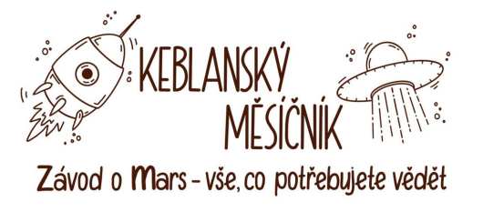

Osídlení Měsíce lidstvu pomohlo trochu oddálit dobu, kdy úplně dojdou nerostné suroviny. Naši
Měsíční zpravodajové přesto potvrzují dlouhodobé obavy, že i zásoby Měsíce se nebezpečně blíží
svým limitům.

Odborníci z celého světa se shodují na tom, že bude potřeba najít nové řešení. Naši exkluzivní
experti (dále jen EE) považují za jeden z nejpravděpodobnějších scénářů přesun těžby na Mars. Podle
nich lze tedy očekávat, že se spustí tzv. Závod o Mars, ve kterém budou lidé soutěžit o nejvýhodnější
pozici na Marsu. Aneb kdo dřív přijde, ten dřív těží.

Podmínky na Marsu se diametrálně liší od těch nám známých na Zemi a Měsíci, proto týmy
předních vesmírných specialistů (PVS) a EE přicházejí s letními výcvikovými tábory, které pomohou
jedincům s lepší adaptací na nové planetě. Snaží se takto předejít opakování scénáře osidlování
měsíce, kdy lidé nebyli na přesun připraveni.

Naše redakce pro čtenáře v rámci M-testu porovnala nabídku táborů. Přinášíme Vám tedy
informace o tom, který si ve všech myslitelných kategoriích vedl nejlépe: **tábor Keblany.**

**\_\_\_\_\_\__**

Celé číslo Keblanského Měsíčníku včetně užitečných příloh potřebných k přihlášení naleznete v e-mailu od Kačny.