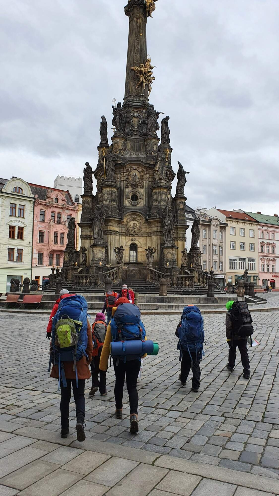

Ve dnech 1.–3. dubna se odehrál aprílový výlet. I přes nepřízeň počasí se Vlci statečně shromáždili na hlavním nádraží v pátek odpoledne a vydali se vlakem směr Olomouc. S půlhodinovým zpožděním jsme nakonec dorazili do místní skautské klubovny, která měla na dvě noci poskytnout úkryt před nelítostnou zimou. Venku začaly chvilkami padat drobné sněhové vločky. Večer Vlci spořádali jídlo od maminek i tatínků a všichni šli brzy spát, aby získali dost energie na sobotní výlet.

V sobotu jsme si dali za cíl pokořit Svatý kopeček. Vzhledem k zimě jsme ale radši jeli až na místo tramvají a autobusem. Kousek od zastávky už na nás čekala krásná bazilika Navštívení Panny Marie. Poté, co jsme se dostatečně pokochali, jsme obešli místní ZOO obloukem a raději vyrazili objevovat místní krásy přírody. Abychom nepodlehli trudomyslnosti, hráli jsme po cestě „Hádej kdo“ a občas utíkali na pařezy před povodní. Na oběd jsme udělali zastávku u zříceniny kláštera Vallis Josaphat. Tam nás ovšem zima dostihla a aby nám neupadly prsty zmrzlé při krájení a mazání chlebů, museli jsme zase rychle dál. Bojový duch začal ve skupině postupně upadat. Nakonec jsme se dohodli na hrdinském ústupu a zkrátili okruh na krásných 10 kilometrů. Ještě jsme si ale stihli přes plot s nápisem „VSTUP ZAKÁZÁN“ prohlédnout Fort II Radíkov, poslední pevnost postavenou na území České republiky. Potom už jsme po zelené pospíchali zpátky do tepla. Náladu ve skupině nakonec zvedlo vítané zpestření v podobě dětského hřiště u zoologické zahrady.

V klubovně se někdo zabavil deskovkami, jiní zase poskakováním ve spacáku. Mezitím jsme začali vařit brambory, které byly i přes pochyby pár vlků, hotovy před půlnocí. Po bramborách na loupačku jsme ještě zahráli jednu hru Fantoma Prahy, než jsme naprosto vyčerpáni zalezli do spacáků.

Na neděli byla naplánována turistika po Olomouci, ale ne jen tak ledajaká. Vlci dostali za úkol najít tajný poklad, který lidé z Olomouce kdysi schovali na horší časy. K tomu jim sloužila mapa a zašifrované nápovědy, které dostávaly po cestě. I přes neutuchající zimu si vlci se vším hravě poradili a navštívili tak třeba Sloup Nejsvětější trojice, kostel svatého Moritze nebo olomoucký orloj. Výpravu jsme zakončili u krytu civilní obrany, kde vlci získali zasloužený poklad v podobě sladkostí. Potom už jsme spěchali co nejrychleji na nádraží a hurá vlakem za maminkami.

Komu nestačí jedna fotka, nechť si prohlédne [zbylé na Rajčeti](https://keblany.rajce.idnes.cz/Aprilovy_vylet_do_Olomouce/)!

