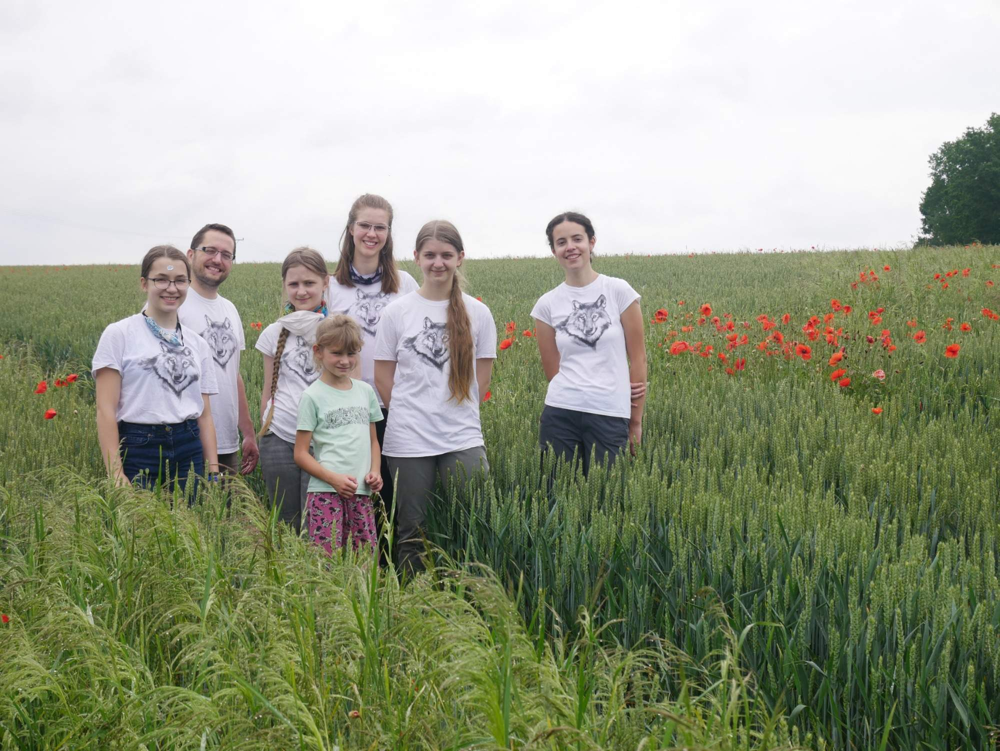
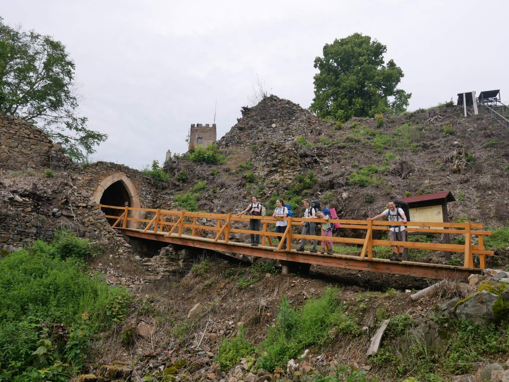
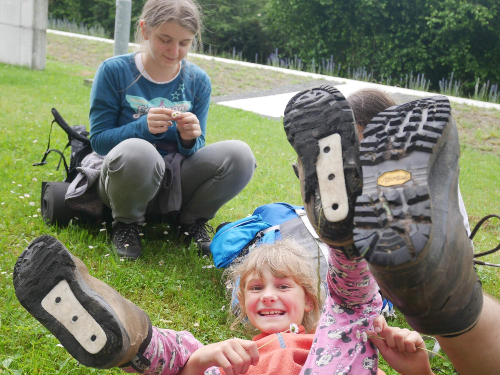

### Report od Šprušle a Emy

Vydali (nebýt Máti vydaly) jsme se takhle jednou do podhůří Šumavy. Ve vlaku, který  jel do Domažlic stejně dlouho jako před sto lety, jsme shledali, že naším cílem je hrad Rýzmburk námi překřtěný na Rambibouze. U rybníka jsme s Kačnou a jejími přáteli poobědvali hum(m)us. Tak tedy na tu Ramziboudu jsme se vydali, ve vlčích mácích vlky vyfotili a kolem Klobouku jsme tam došli. Avšak poznatkem nám jest, že rozhledny mají býti v údolí, což tato betonová věž (která ani nebyla na místě původní věže) velice nesplňuje. Kromě zříceniny o dvou nádvořích jsme vyzkoušeli podhradní amfiteatr a jeho skvělou budku pro nápovědu. Dorazili jsme šťastně, uvařili jsme chutně, vyspali se hezky a šli dál podle zelené stezky. (Aniččiny boty zevnitř podrážky vypadají hezky). 

### Report od Lůči

Předtáborový bivak vyhráli co do účasti děti nad vedoucími. Ale bylo to o fous! Vláčkem jsme se dokodrcali do Domažlic a odtamtud vystoupali až na hrad Rýzmberk (tj. Rambibouze, Ramzibouda...), kdežto jsme v luxusním altánku přenocovali (měkké "i" ve větách zajišťuje pouze Máťa). Výlet to byl dobrodružný, nejedna pohorka nezůstala celá! Kdo nezažil, nechť [hledí](https://keblany.rajce.idnes.cz/Predtaborovy_bivak_-_Sumava_06_2020/)!

