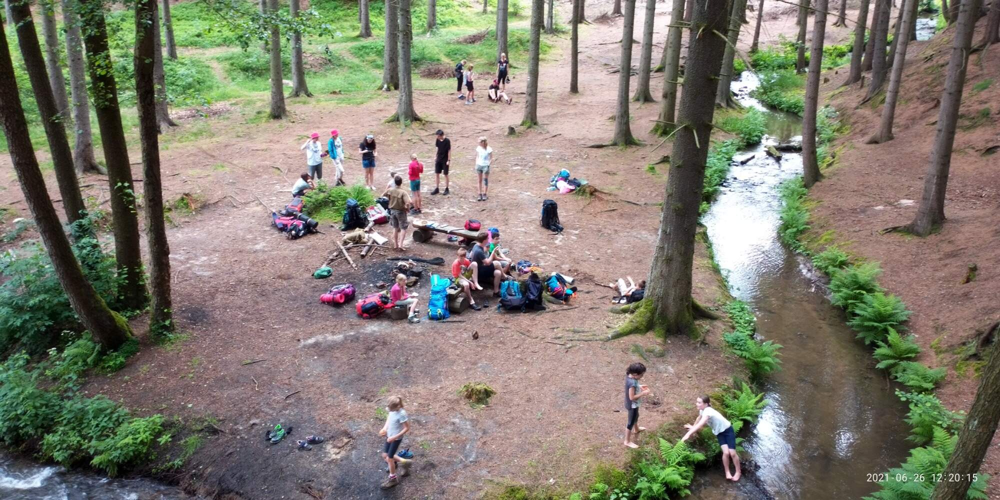
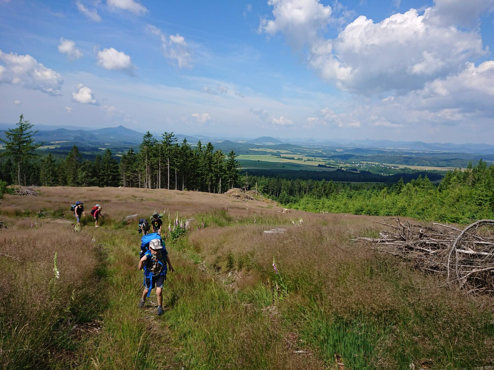
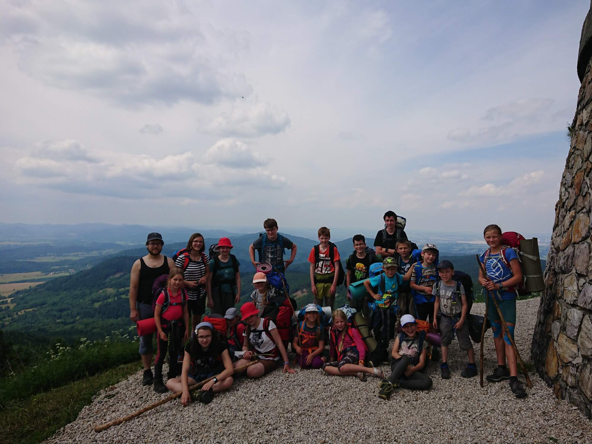

Prosím, famfáru! Skoro po roce domazašívání jsme vyrazili na tradiční červnový bivak! Bez něj by to nešlo, dá rozum, neasi. Sešla se nás pořádná smečka, z toho spousta nových vlčích tváří. Po dobách koronáčových byla vyloženě radost pozorovat celé to hemžení a nadšení. Hráli jsme vláčky v jurtě, prozkoumali trosky hradu Děvín, přespali pod skalním převisem a dokonce vyšplhali na Ještěd! Zmrzku na libereckém nádraží jsme si vyloženě zasloužili. Nostalgické duše, zvědaví rodičové a nebivačníci, nechť nahlédnou na [fotky na našem vlčím rajském jablku](https://keblany.rajce.idnes.cz/Bivak_v_okoli_Jeste_jdu_06_2021/).

Chlebu a kolínkům s bravčovým zdar!

