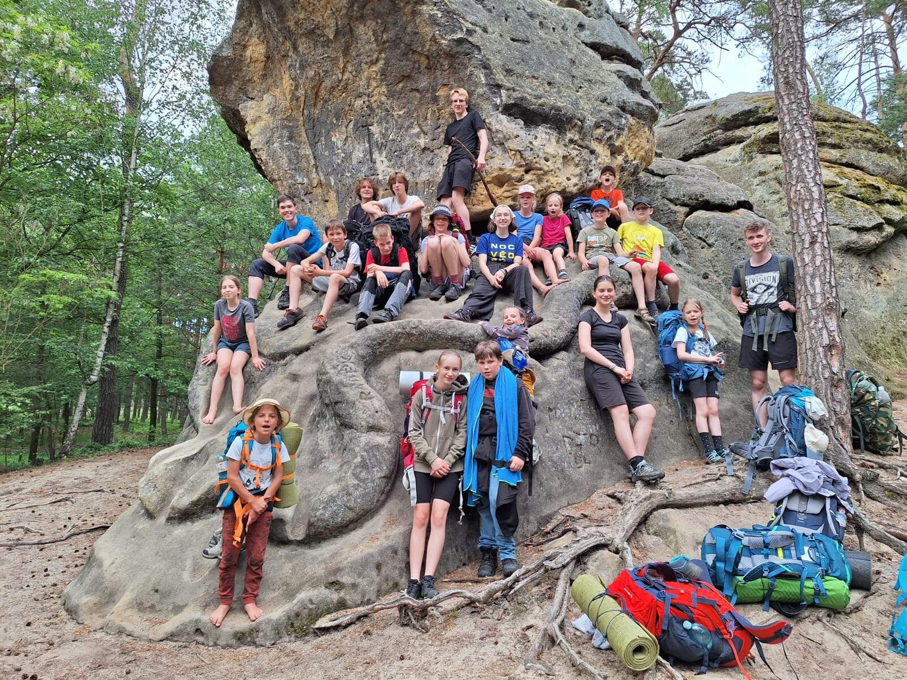

Letošní předtáborový bivak směřoval za Mělník ke skalním rytinám Václava Levého. Pohodovým tempem jsme jich za slunečného dne obešli hned několik, a u každé děti radostně odložily krosnu a odpočinuly si (většinou běháním či lezením). Noc jsme přečkali u Mordlochu, kde kromě jeskyně a ohniště bylo i Sedm chlebů (rip tenisáky). Celkem jsme i přes parné letní počasí a kratší časový formát nachodili okolo dvaceti kilometrů.

Na rajčeti se dělíme o pár [fotek](https://rajce.net/album/WtLXU1EumaEGGTtr).

