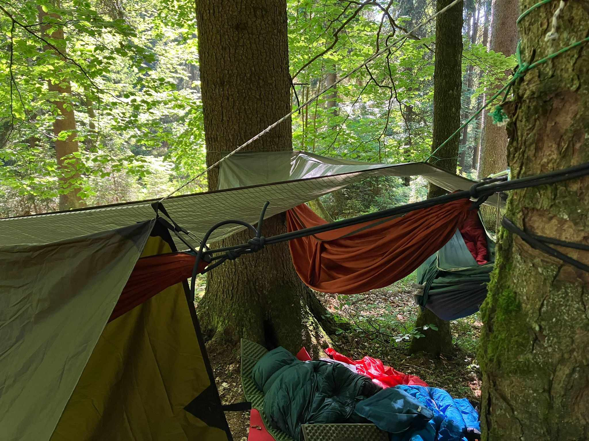

**Bivak rychlých chlebů**

V pátek 14. června se skupina čítající 8 vlků vydala z Hlavního nádraží do Ramzové v Rychlebských horách. Cestou jsme mimo jiné cestovali časem (díky špatně nám prodaným lístkům), rozeznávali vlakové návěsti a otevřeli česací salón. V cílové zastávce jsme se poučili o troše železničního názvosloví a vyrazili vzhůru ku Smrku. Pod tímto vrcholem jsme do třetice všeho dobrého našli krásné nocoviště u pramínku a rozhodili tábor. Povečeřeli jsme z kotlíku čínskou polévku čtyř příchutí a odebrali se na kutě.

Ranní ptáčata se jala vařit čaj lesa (poznatek: mladý smrk chutná jako citron) a po postupném probuzení všech vlků i vedoucího jsme ukuchtili výbornou kaši. Doplnili jsme vodu a vyrazili kolem dalšího pramene na Smrk - horu, která byla prvním bodem naší cesty po česko-polské hranici. Během ní jsme samozřejmě nezapomněli srovnávat kvalitu vzduchu a krásu lesa těchto dvou zemí a zapsali jsme se do několika vrcholových knih. Po náletu bílých mušek a opětovném ztrácení Julčiny hole jsme opustili hranici směrem k pramenu Peklo. Opět jsme nabrali vodu a od našeho cíle nás dělilo už jen málo. Zakotvili jsme v krásné útulně na kraji zaniklé vesnice Kamenné, kterou postavili v rámci projektu žáci jisté ZŠ. Mohli jsme si tak přiblížit teskný kus naší historie a zároveň obdivovat krásu přírody. Našli jsme pramen (u býv. hasičárny) a Kraťák jej zanesl do map, aby se jím mohli osvěžit i další poutníci po nás. Po večeři jsme vyrobili další stěnu z plachty a za zvuků sílícího deště jsme od Kraťáka vyslechli tématickou pohádku Robinson na Otavě.

V neděli jsme vyrazili mokrou travou na pěšinku, u které jsme potkali zvoničku (na místě, kde stávala Josefova kaple). Putování jsme naplňovali hraním kontaktu, dračáku a pletením věnců. V žulové jsme ještě stihli navštívit bývalý hrad přebudovaný na kostel a pak již začala naše cesta třemi vlaky zpět do hlavního města.

Bivak byl tedy nadmíru povedený - počasí nám přálo, noví bílí vlci obstáli výtečně, vody jsme měli hojně, hamaky se osvědčily a s nedostatkem lžic jsme si také poradili. Tak naviděnou na táboře!

[FOTKY](https://eu.zonerama.com/vlci-keblany/1303470?secret=R29V8G02MMYv0gPl94klH1g49)

