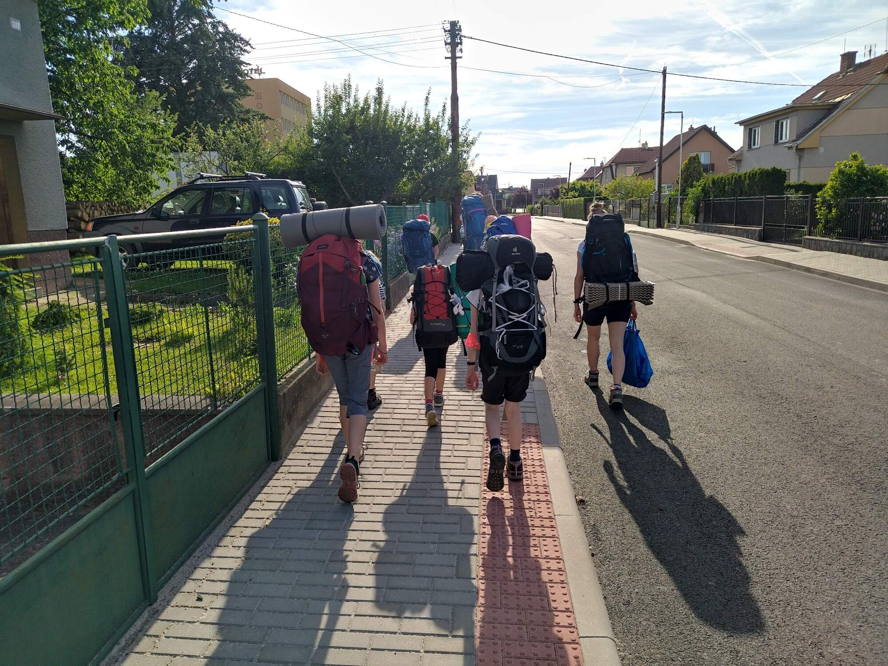

Během víkendu 17.-19. 6. proběhl tradiční červnový bivak. Vyrazily (ano, není to hrubka, letos opravdu pouze v dámském složení) jsme v pátek odpoledne vlakem do Vlašimi, kde jsme navštívily hvězdárnu a přespaly v místní základní škole. V sobotu jsme se výletem vydaly až k Českému Šternberku, kde jsme poblíž hladomorny přespaly, a v neděli jsme s koupáním v Sázavě dorazily na vlak do Sázavy. Odtud jsme pak odjely zpět ke svý domovů směrem ku Praze. Při zpáteční cestě jsem navíc sestrojily krátký report z výletu zachycující jeho nejdůležitější okamžiky. Tedy čtěte dále!

####

Měly jsme čerstvě uzenou okurku, která nám ve vlaku omylem spadla a ulomil se jí vršek. Tuto okurku jsme pojmenovaly Anča.

Ve vlaku jsme dále potkaly holčičku jménem Esterka s papírovou kytarou, která se nás zeptala, když jsme svačily: "Co papáš?"

Esterka se zeptala Áni junior, jestli je Anička senior její babička.

Přijely jsme do Vlašimi, tam jsme šly navštívit hvězdárnu. Celý den bylo vedro a nebe bez mráčku, ale večer se zatáhlo a ve hvězdárně jsme proto nic neviděly. Byl tam upovídaný chlapeček a točily jsme kupolí. Pak jsme bloudily nocí zpátky ke škole, kde jsme spaly.

Ráno jsme viděly krásnou fontánu ve Vlašimi. Při svačině, u které jsme viděly malá káčátka, nás velká Kač(e)na opustila. Dál jsme pokračovaly v menším počtu směr Český Šterberk. Večer jsme si vyřezávaly lžíce. Nakonec se použily spíš jako měchačky. Večeřely jsme těstoviny s brokolicí, jedly ve stylu kolujících lžic a hrály sochy v akci. Večer jsme viděly světlušky a hvězdičky.

Ráno byla Báře zima. Posnídaly jsme zbytek těstovin a s plnými břichy se šly podívat na hladomornu. Pak jsme viděly krásný Český Šterberk a doplnily vodu ve studánce Katovka. V kopci nad studánkou byly dobré jahody. Bylo to nahoru, dolů, nahoru, dolů, nahoru, dolů... Potkaly jsme paní, co hledala malého bílého pejska. Jmenoval se Betynka. Pak jsme sešly dolů k řece, daly si oběd a koupaly se v Sázavě. Káčátka na dva metry od nás! Anička jr. s Áňou jr. se snažily se shodit do řeky a Emilka si sedla do řeky.

Do cíle už to pak bylo jen pár kilometrů, ale nám se zdálo, že je to daleko dál. Poprosili jsme projíždějící cyklisty, aby nám svezli batohy, ale cyklisti prosbě nevyhověli. V Sázavě jsme byly s předstihem, tak jsme si stihly dát na náměstí zmrzlinu. Šárce dali místo míchané jen jahodovou a ještě se jí rozmočil kornout. Viktorka měla zmrzlinu až na kloboučku.

Pak už nás čekala pouze úmorně teplá cesta domů vlakem, kde jsme si střídaly vějíř. Střídání probíhalo v časovém intervalu do 10. Ve vlaku jsme taky napsaly zápis o výletu.

####

Takže, jak vidíte, bivak byl opravdu hvězdný po všech směrech! :D

Váš výletnický tým

P. S.: Ještě [fotky](https://keblany.rajce.idnes.cz/Hvezdny_bivak_06_2022/)

