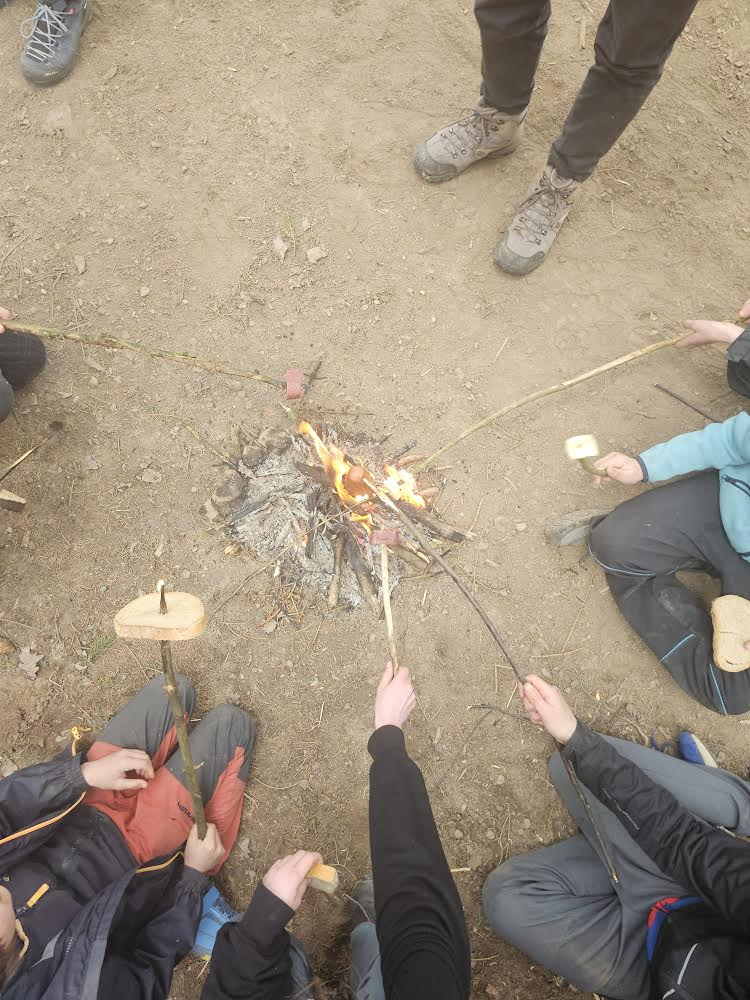

O víkendu 10.-12. 4. jsme absolvovali, jak Ovál podotknul "výlet tradičního formátu, Praha-Budějovice-Borovany-Keblany-Jägerhaus-Ločenice-Budějovice-Praha". Přes počáteční nepřízeň počasí se v sobotu v noci vyjasnilo a ráno jsme se budili do šedé louky zalité vycházejícím Sluncem. Po vydatné snídani jsme vyrazili ven, připravili jsme si dřevo na vaření, omyli se v tůni, prozkoumali okolí hájovny, uvařili si oběd a vyrazili do tábora. V táboře nebylo po nikom ani vidu ani slechu. Fotbalový míč, který jsme pustili do přehrady jsme pak následovali korytem potoka az k Pellarově mlýnu, při čemž se několika z nás povedlo vykoupat se v potoce. Část z nás, která byla suchá a při síle se ještě porozhlédla po starém mlýnském kole, vantrokách a konci náhonu. Pak už jsme spěchali zpět do hájovny. Dílčím úkolem výletu bylo i osazení části louky novým travním porostem, děti se toho zhostily s vervou a skoro nám nezbylo travní semeno. K večeru jsme zapálili oheň, upálili dřevěného panáka a opékali buřty. V neděli se hlavně balilo a poklízelo, což zabralo celé dopoledne. Následně jsme procházkou přes Větrnou Hůrku došli až na malebné místo na kraji lesa a louky, kde jsme na cestě dopekli poslední buřty, sýry, salámy, chleby a řapíkatý celer. Polní cestou jsme pak vyčerpaní dorazili do Ločenic, kde už jsme se jen váleli a vyčkávali na autobus. Návaznost spojů byla vynikající, na Hlavák jsme dorazili o 5 minut dřív. 

Účast: Teo, Eliáš, Tristan, Přemek, Matěj, Štěpán, Jindřich, Jonáš, Meda, Šárka, Emilka, Maruška, Martin, Ferda, Dorotka, František, Johanka, Ovál a Jenda

[FOTKY](https://eu.zonerama.com/vlci-keblany/1303470?secret=R29V8G02MMYv0gPl94klH1g49&count=46)

Sepsáno v tramvaji č. 9 12. 4. 2026

Jenda
