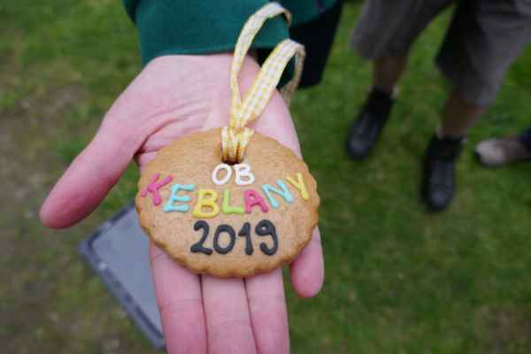

V květnu jsme slavnostně pokřtili novou mapu Keblanského potoka! A jak jinak pokřtít mapu, než tím, že se podle ní rovnou vlastnoručně ztratíte? Spousta z nás si poprvé prohlédla tábor jindy, než během prázdnin, podívala se (zabloudila) do končin, kde ještě nikdy nebyla nebo poprvé viděla v táboře takovou haldu lidí! Když se totiž spojí všechny skupiny, které do keblanských hvozdů jezdí, je to smečka na druhou. Slovutní autoři naši nové mapy - Matula, Drbal, Píro - by z nás měli radost. Nezapomeňte kouknout na [fotky](https://eu.zonerama.com/vlci-keblany/1303470?secret=R29V8G02MMYv0gPl94klH1g49&count=46)!

