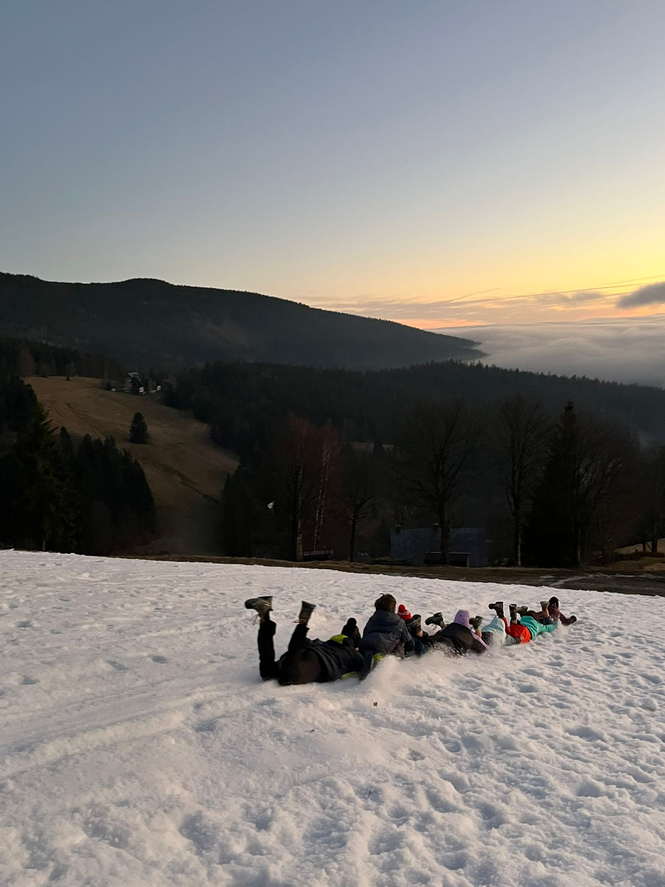

Páteční cesta autobusem kolem 6.-7. hodiny byla v rytmu a posunek six seveeeeeeeeeen. Výšlap sjezdovkou byl skvělý nápad, hlavně pro ty, co ho nevymysleli. První věc po doražení do chaty byl boj o pokoje s okamžitým rozložením spacáků. Hra kostky podle Kingdom Come Deliverance ovládla víkend víc než cokoliv jiného. V pokoji černých vlků probíhala tajemná představení, jejichž obsah zůstává utajen. Sníh nebyl žádný, ale počasí to vynahradilo až podezřele krásnou sobotou. Zmrzlé prsty z pátečního výšlapu jsme v sobotu úspěšně rozmrazili na sluníčku. Nejdřív nám byla zima, pak vedro a nakonec jsme nevěděli, jestli chceme ještě žít. Na Dvoračky jsme došli, limonádu vypili a tvářili se, že výlet opravdu nebyl náročný, ale jak říkal Štofi „výlet tak na protažení nohou“. Po západu slunce dorazil Ježíšek i s vánočním stromečkem a nadělil dárky, které byly rozdány sofistikovanou metodou náhodných čísel (vyšlo to). Následně proběhla tradiční směna dárků dle preferencí. Večer pokračoval deskovkami a hrou Sardel, kde se ukázalo, kdo má skutečný talent. Vlčí Vánoce proběhly úspěšně, většina se neztratila a všichni přežili, až na Jonášovu čepici. Nejhorší byl výšlap, nejlepší všechno ostatní. Těšíme se na příště, ideálně se sněhem, ale klidně i bez něj.

Pohleďte na [FOTKY](https://eu.zonerama.com/vlci-keblany/1303470?secret=R29V8G02MMYv0gPl94klH1g49)!

