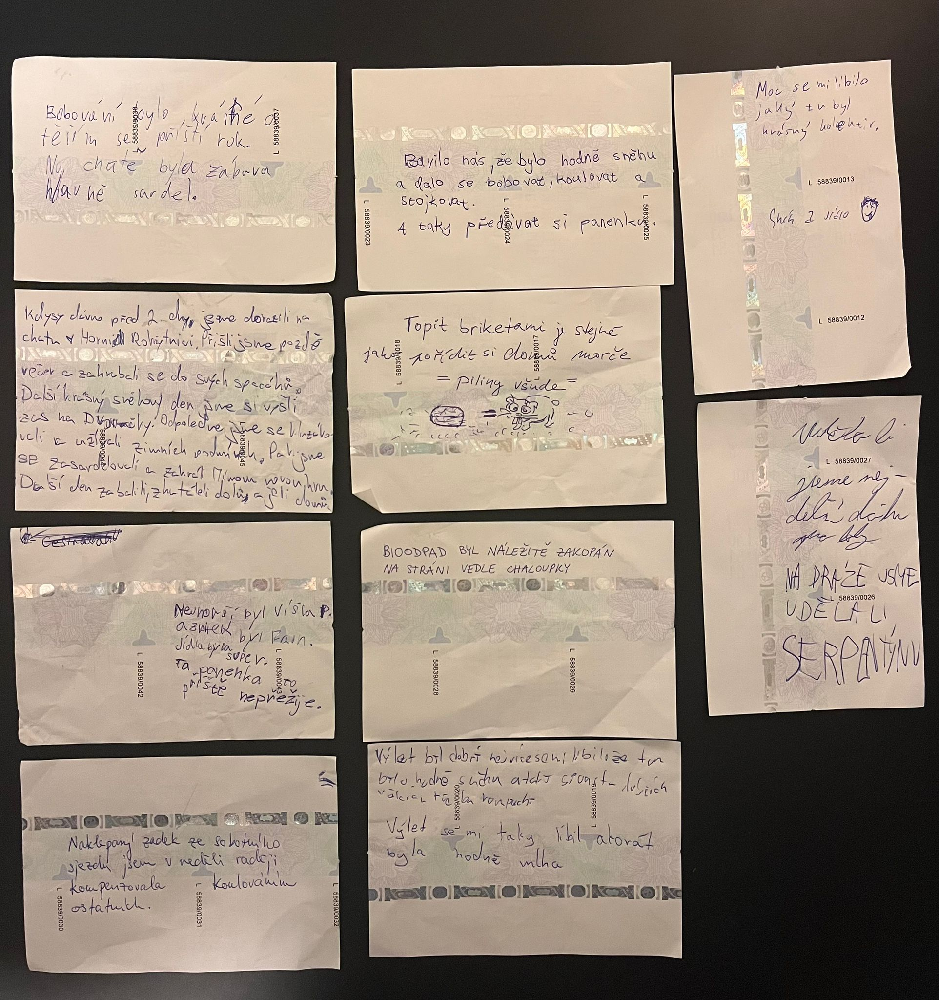

Zápis jako již tradičně zapsali Vlci při zpáteční jízdě autobusem. Tentokrát ekologicky na autobusové lístky.

Naklepaný zadek ze sobotního sjezdu jsem v neděli raději kompenzovala koulováním ostatních.

Topit briketami je stejné jako pořídit si domů morče - piliny všude.

Bioodpad byl náležitě zakopán na stráni vedle chaloupky.

Moc se mi líbilo jaký tu byl krásný kolektiv, sníh a jídlo. 

Kdysi dávno před 2 dny jsme dorazili na chatu v Horní Rokytnici. Přišli jsme pozdě večer a zahrabali se do svých spacáků. Další krásný den jsme si vyšli zas na Dvoračky. Odpoledne jsme se kluzákovali a užili zimních podmínek. Pak jsme se zasardelovali a zahráli Mímovu novou hru. Další den jsme zabalili, zakutáleli a jeli domu. 

Nejhorší byl výšlap a zbytek byl fajn. Jídla byla super. Ta panenka to příště nepřežije.

Výlet byl dobrý, nejvíce se mi líbilo, že tu bylo hodně sněhu a taky spoustu dalších věcí, třeba rampouchů.

Výlet se mi líbil, akorát byla mlha.

Bavilo mě, že bylo hodně sněhu a dalo se bobovat, koulovat a stojkovat a taky předávat si panenku.

Udělali jsme nejdelší dráhu pro boby a na dráze jsme udělali serpentýnu.

Bobování bylo krásné a těším se na příští rok. Na chatě byla zábava, hlavně sardel. 

Další fotky račte obdivovat [ZDE](https://eu.zonerama.com/vlci-keblany/1303470?secret=R29V8G02MMYv0gPl94klH1g49)