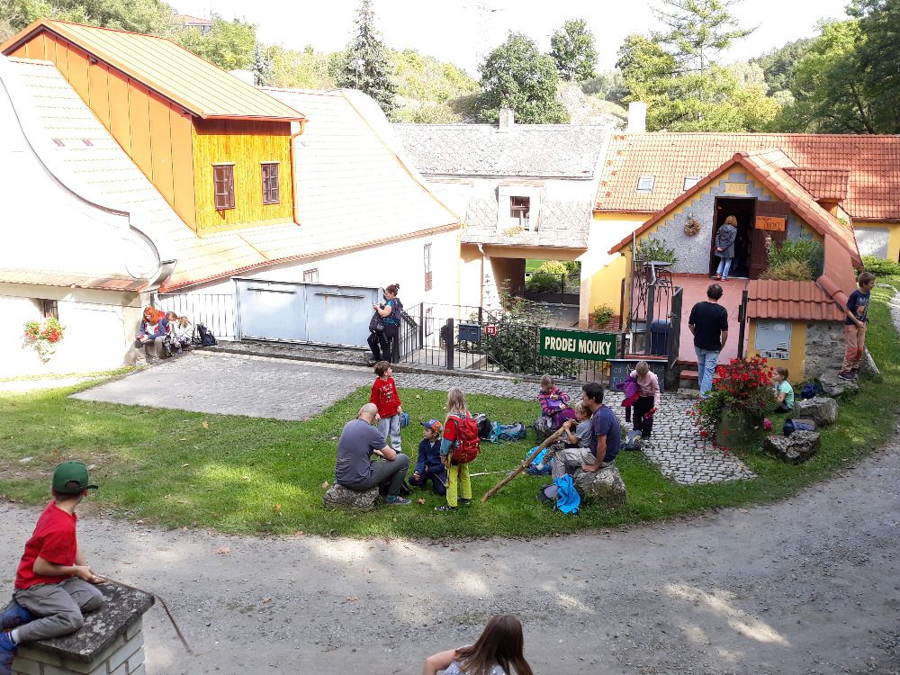

Kdo nebyl o hodně přišel. Tak by se dal popsat říjnový výlet do mlýna. Kousek od Prahy v údolí Radotínského potoka se nachází vodní Mlýn U Veselých. S početnou vlčí smečkou jsme se vydali vláčkem do Černošic a poté směrem Choteč. Cestou jsme si hráli na Youtubery, ale třeba i na medvěda a povodeň. Ve mlýně to vypadalo jak za starých časů, jen už také více spoléhají na elektřinu než na sílu vody z rybníka ;-(. Každopádně víte jak vzniklo rčení mít za lubem? Že ne? Tak příště určitě vyjeďte s námi na výlet a vlci z mlýnského výletu vám to rádi prozradí. Nebo se třeba vydejte k Veselým na výlet - stojí to za to...

Pokochejte se [fotkami](https://keblany.rajce.idnes.cz/Po_stopach_mlynarskeho_umeni_10_2021/).

