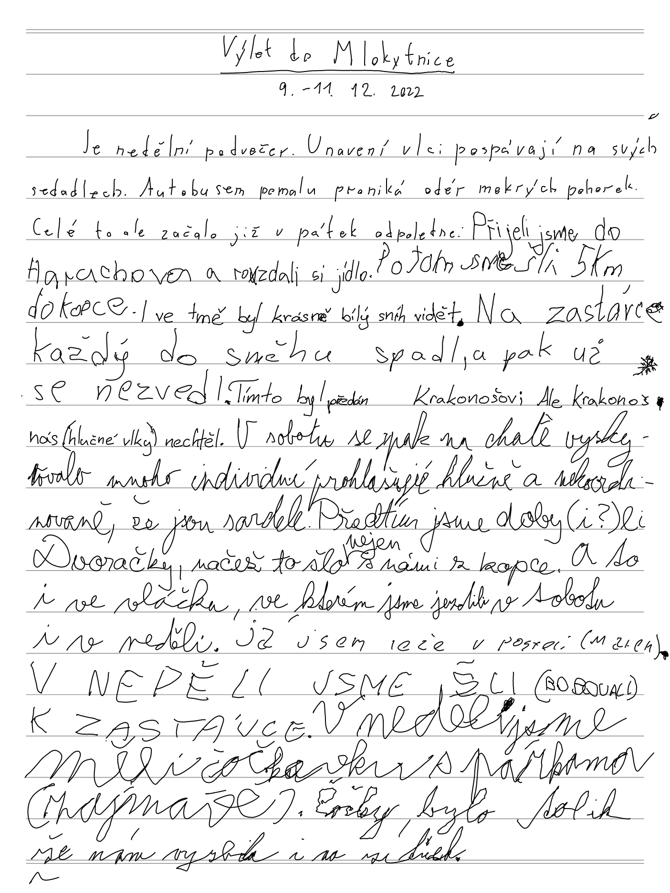

V prosinci jsme s početnou vlčí smečkou čítající všehovšudy 17 vlků všech druhů vyrazili na chaloupku do Rokytnice nad Jizerou. Jak jsme se tam měli nejlépe dokumentuje zápis vytvořený postupně po jedné větě všemi zúčastněnými vlky cestou z výletu v autobusu. Přepis zápisu hledejte hned o odstavec níže a jeho originál ještě kousíček pod ním. A koho by zajímalo i těch několik obrázků, které jsme pořídili, klikejte s chutí sem -> <https://keblany.rajce.idnes.cz/Pomikulasska_Rokytnice_12_2022/>.

## Výlet do Mlokytnice

*9.-11. 12. 2022*

Je nedělní podvečer. Unavení vlci pospávají na svých sedadlech. Autobusem pomalu proniká odér mokrých pohorek. Celé to ale začalo již v pátek odpoledne:

Přijeli jsme do Harrachova a rozdali si jídlo. Potom jsme šli 5 km do kopce. I ve tmě byl krásně bílý sníh vidět. Na zastávce každý do sněhu spadl, a pak už se nezvedl. Tímto byl předán Krakonošovi, ale Krakonoš nás (hlučné vlky) nechtěl. V sobotu se pak na chatě vyskytovalo mnoho individuí prohlašujíc hlučně a nekoordinovaně, že jsou sardele. Předtím jsme doby(i?)li Dvoračky, načež to šlo nejen s námi  z kopce. A to i ve vláčku, ve kterém jsme jezdili v sobotu i v neděli. Já jsem ležel v posteli (Marek). Vneděli jsme šli (bobovali) k zastávce. V neděli jsme měli  čočku s párkama (zajímavé). Čočky bylo tolik, že nám vyzbila i na zítřek. A pak jsme na autobus a tím náš vílet končil. Kvůli tomu že sme se začali nudit. A všichni bili sklamaní kvůli tomu že sme nemohli svačit v autobuse. A všichni si začali povídat. A povídali a povídali... Projeli jsme Železný Brod, Turnov, Mladou Boleslav... A jeli dál a dál... A když sme usoudili že u nás nebavilo tak už sme se jenom nudili. 

(poznámka editora: text je přepsán ve svém původním znění, jeho přesný originál je kousíček níže)

