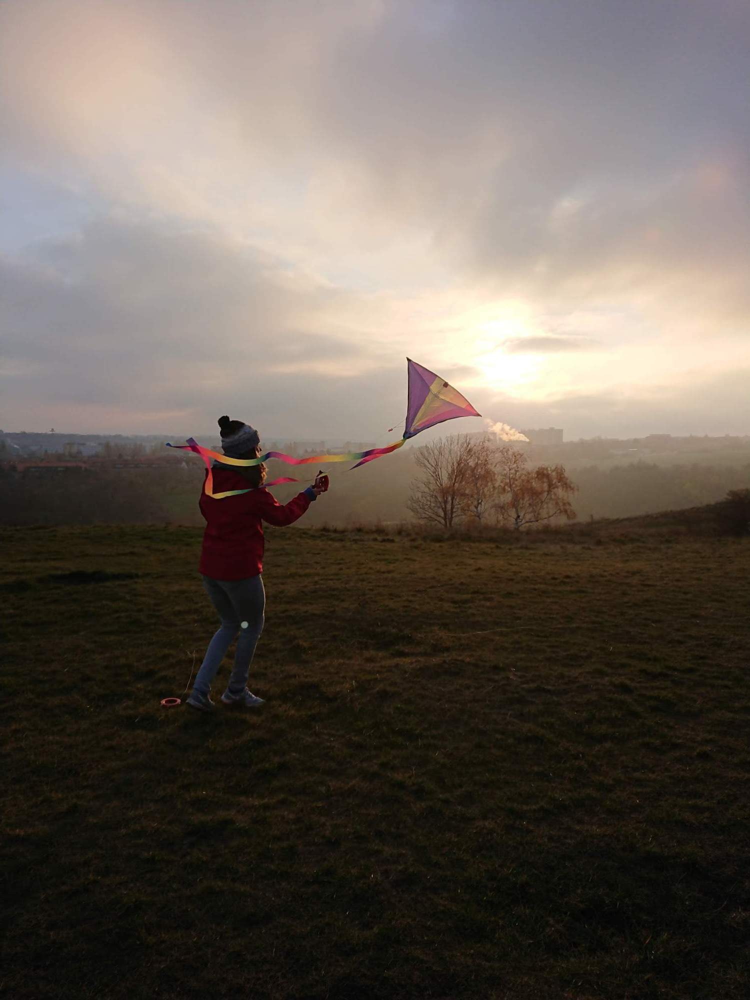

Co by to bylo za podzim bez pouštění draků? Podzim dozajista mrzutý a zachmuřený. A tak jsme společně vyrazili provětrat své létající papírové mazlíčky do Divoké Šárky. Mimo jiné kratochvíle jsme prolomili předsudek, že k pouštění draků je potřeba vítr, a to se jen tak někomu nepovede! Pokochat se můžete [zde](https://eu.zonerama.com/vlci-keblany/1303470?secret=R29V8G02MMYv0gPl94klH1g49&count=46).

