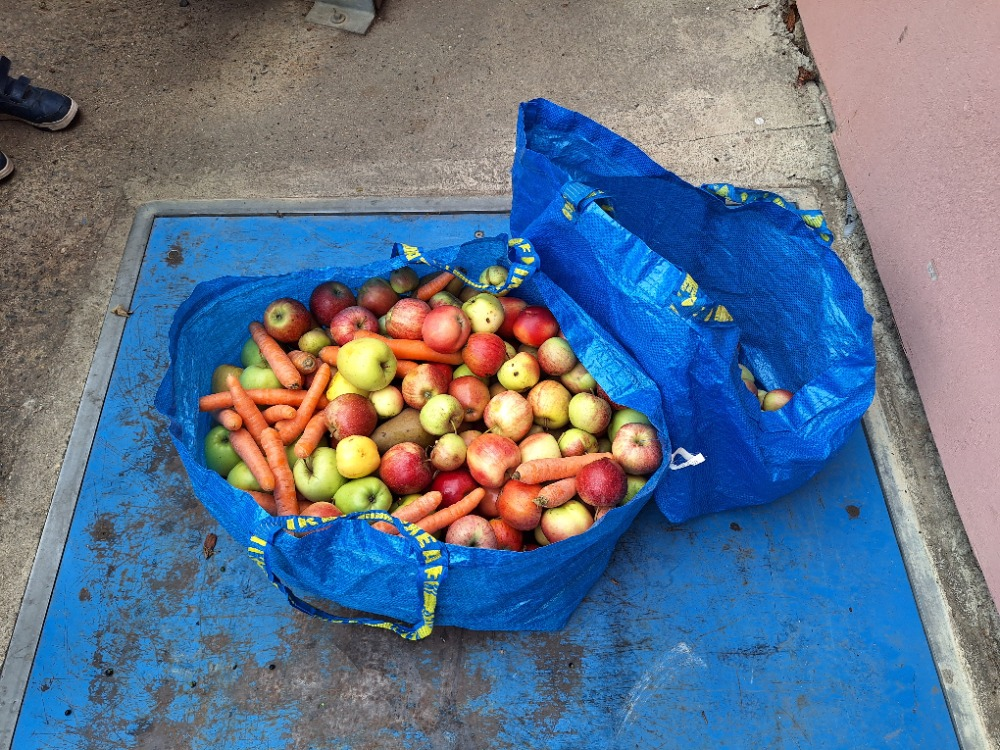

Na výlet nazvaný Pravidla moštárny v sobotu 23. 9. se nás sešla slušná vlčí smečka. Výlet začal nástupem do cyklovláčku (což je v podstatě hřišťátko na kolejích) a vyblbnutím se dosytosti až do Slaného. Odtud přes Kvíček jsme dorazili až do místní moštárny v Kvíci a dali všechno ovoce na jednu hromadu a do lisu. Výsledek z jablek, mrkví, hrušek a zázvoru byl báječný a tak se po něm jenom zaprášilo. Poté jsme vyrazili přes Kumpánovu zahradu (zde jsem viděl poprvé v životě motorovou pilu na kámen :-)) na vrch Slaný s krásným výhledem na město. Na závěr dne jsme opět vyrazili hráčkemdráčkemcyklovláčkem do Prahy, kde už nás očekávali maminky a tatínkové. Tak dalším vlčím výletům a moštárnám zdar.

[FOTKY](https://eu.zonerama.com/vlci-keblany/1303470?secret=R29V8G02MMYv0gPl94klH1g49&count=46)

