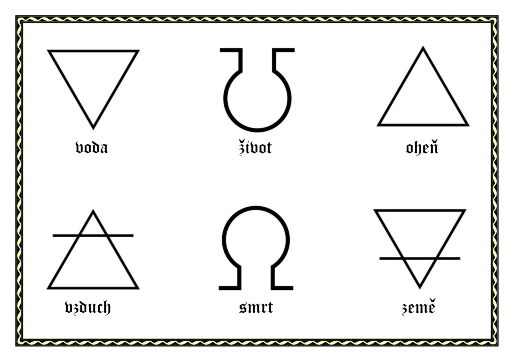

Pražský výlet 3v1 se náramně vydařil. Rekordně početná smečka se sešla už v pátek na vlčím zpívání. Dlouhosenevidění sice nakonec zahrnovalo spíše polštářovou bitvu a drbací kolečko než zpěvy, každopádně ale bylo na všech frontách (tedy v prvním i druhém patře klubovny) veselo.

V sobotu jsme se přesunuli o pět století zpět do časů Rudolfínské Prahy. Naši nadějní alchymističtí učni se nejprve náležitě vzdělali v muzeu Speculum alchemiæ, které bývalo skutečnou alchymistickou laboratoří. V muzeu obdrželi své první recepty na elixíry a neohroženě se vydali do ulic matičky stověžaté, aby sehnali všechny potřebné ingredience. Obdařeni technologiemi z daleké budoucnosti, vyhotovili si také fotografie s významnými místy na trase. Všichni alchymisté svého úkolu dostáli a vítězoslavně dorazili do cíle na Staroměstském náměstí. Odtud se na chvíli přesunuli do městské knihovny ohřát zmrzlé končetiny a zasmažit pár deskovek a pak už hurá ke Staroměstskému orloji. Průvodcem nám byl samotný pan orlojář, který nás naučil orloj číst a zavedl nás do jeho útrob malými dvířky přímo pod hodinami. Někteří tak v celou hodinu pozorovali orloj zvenku, někteří dokonce zevnitř. Odpoledne alchymističtí učni dokonali své dílo a připravili 6 více či méně blahodárných elixírů. Někdo si dal všechny, někdo radši žádný, někdo dokonce začal mícháním ingrediencí tvořit elixíry vlastní. Večer se pak nesl v duchu soch v akci, odmývání nádobí a bloudění v nezměrném Kauflandu na Podbabě.

Výlet jsme zakončili opět ve století 21. pouštěním draků na Babě a výletem do Dolní Šárky a Lysolajů. Mrzlo, ale sluníčko svítilo a nás hřálo mládí.

Nevahejte se podívat na [FOTKY](https://eu.zonerama.com/vlci-keblany/1303470?secret=R29V8G02MMYv0gPl94klH1g49), které tentokrát pořizovala celá smečka fotografů.

