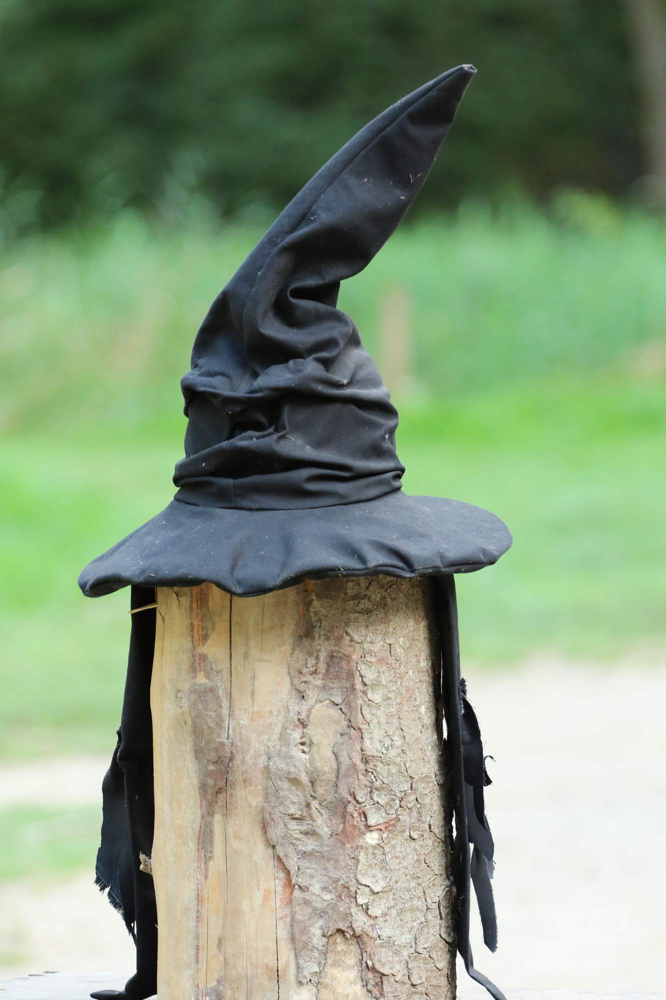

*Nechte si svoje buřinky*

*i své klobouky z plsti*

*jsem moudrý klobouk z Bradavic,*

*jenž vám nic neodpustí.*

*Každému vidím do duše,*

*vím, z jakého je těsta*

*nasaď si mě a řeknu ti,*

*kam povede tvá cesta.*

Moudrý klobouk určitě mluvil o Nesměňce. A ta vede do tábora, který se proměnil ve svět čar a kouzel. Svět plný důmyslných kouzel typu Ducklyforce, kouzelnických soubojů umožňujících vyhrát mytí osmi ešusů a jednoho talíře i nepřekonatelných famfrpálových týmů, proti kterým jsou Kudlejští kanonýři nemotorní, jako stádo pitomých potácivých paviánů.

Akcio [fotky](https://eu.zonerama.com/vlci-keblany/1303470?secret=R29V8G02MMYv0gPl94klH1g49&count=46)!

