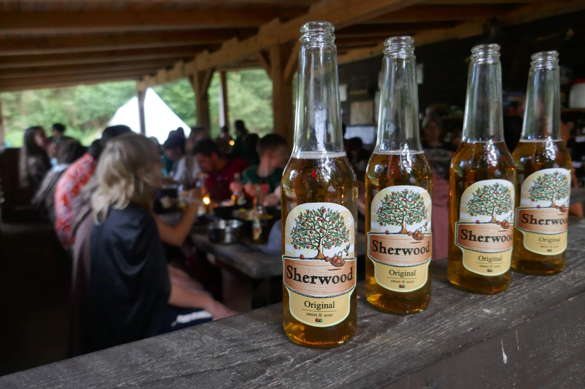
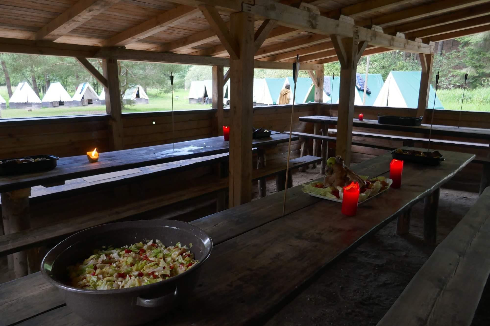
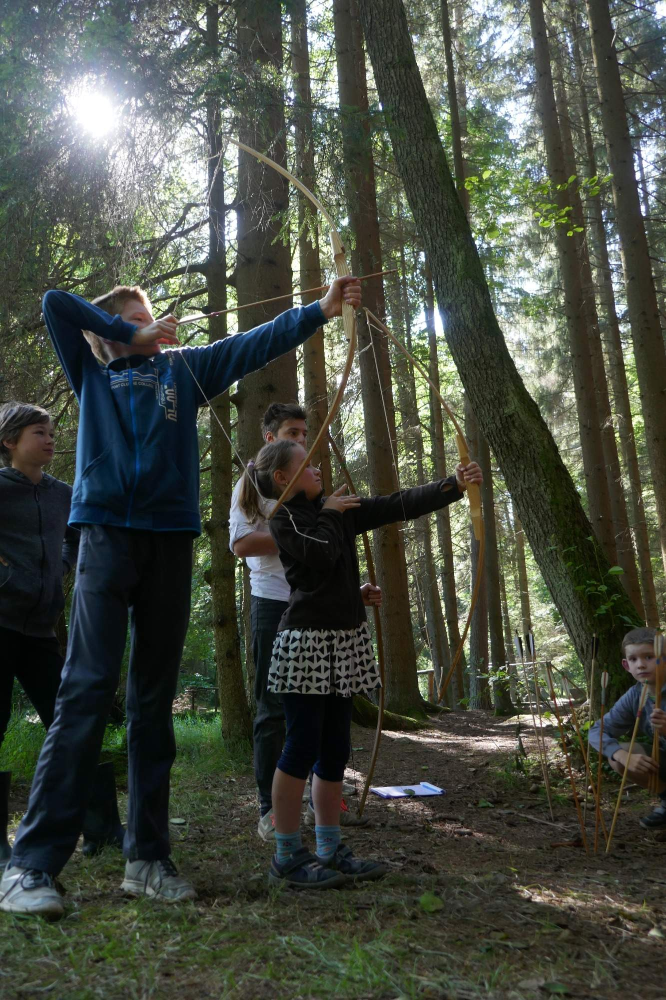
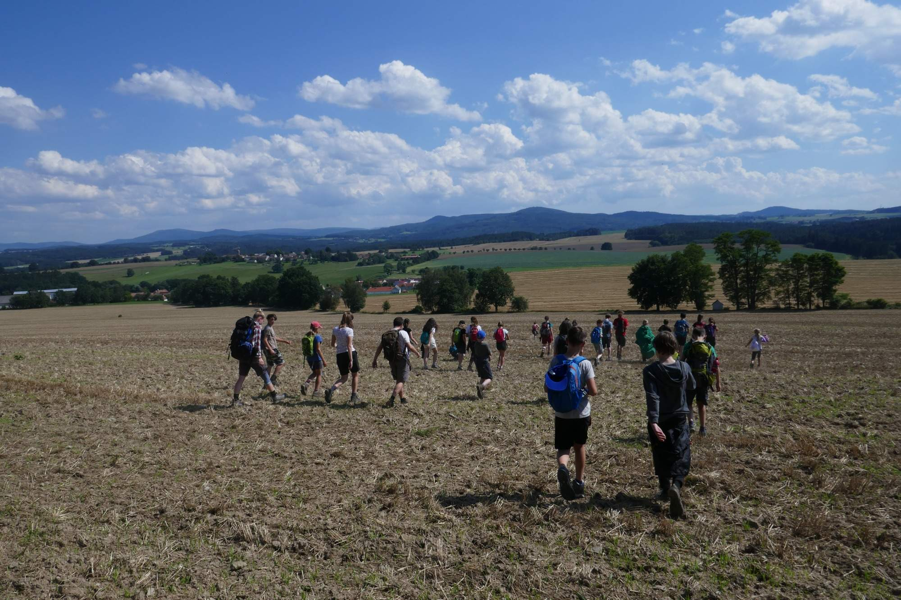
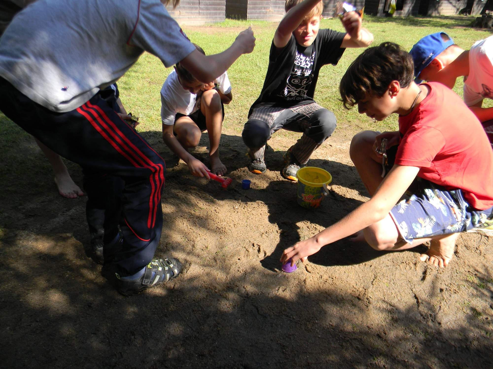
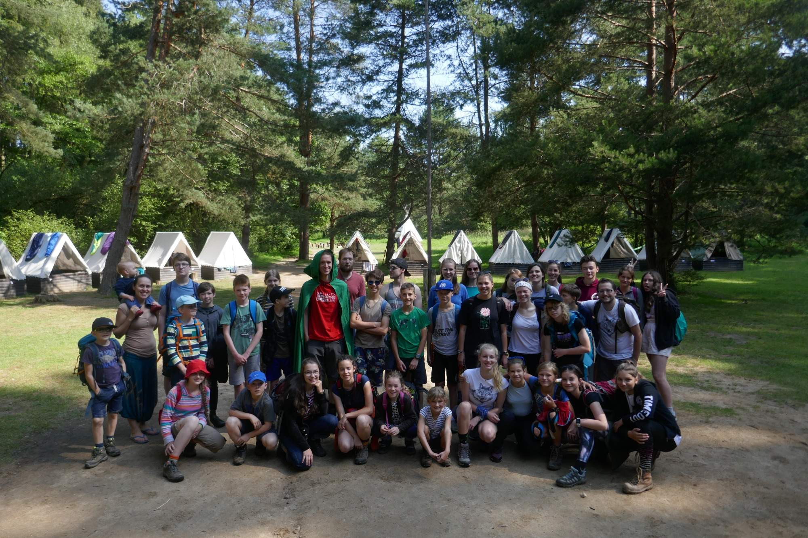

Letos to byl Robin Hood,

v den i noc chránil Sherwood.

Nepoctivců měli jsme plné zuby,

stejně jako komárů. A jídla plné spokojené huby.

Mistrně stříleli jsme z luku,

nikdo naštěstí nepřišel o ruku. (kromě Náti)

Sherwoodský les byl domov náš,

Nottingham, Lincoln - ta místa z mapy dobře znáš.

Nottinghame, jen se třes,

pískujeme o sto šest!

Ten, kdo nechtěl zažít nudu,

ten jel s námi do Sherwoodu! - **[hele fotky](https://eu.zonerama.com/vlci-keblany/1303470?secret=R29V8G02MMYv0gPl94klH1g49&count=46)**

