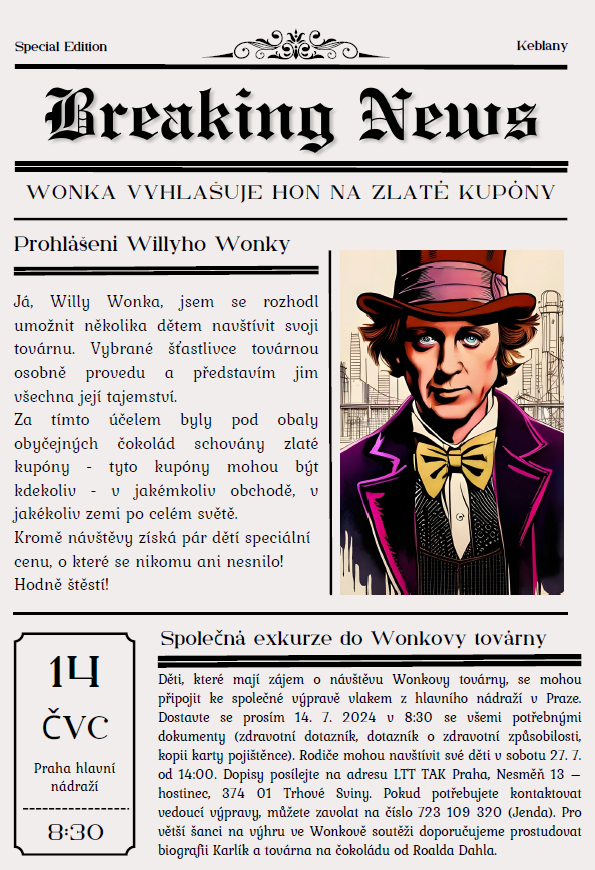
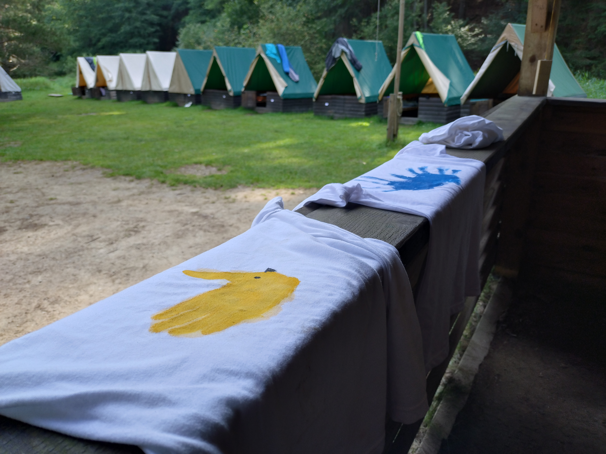
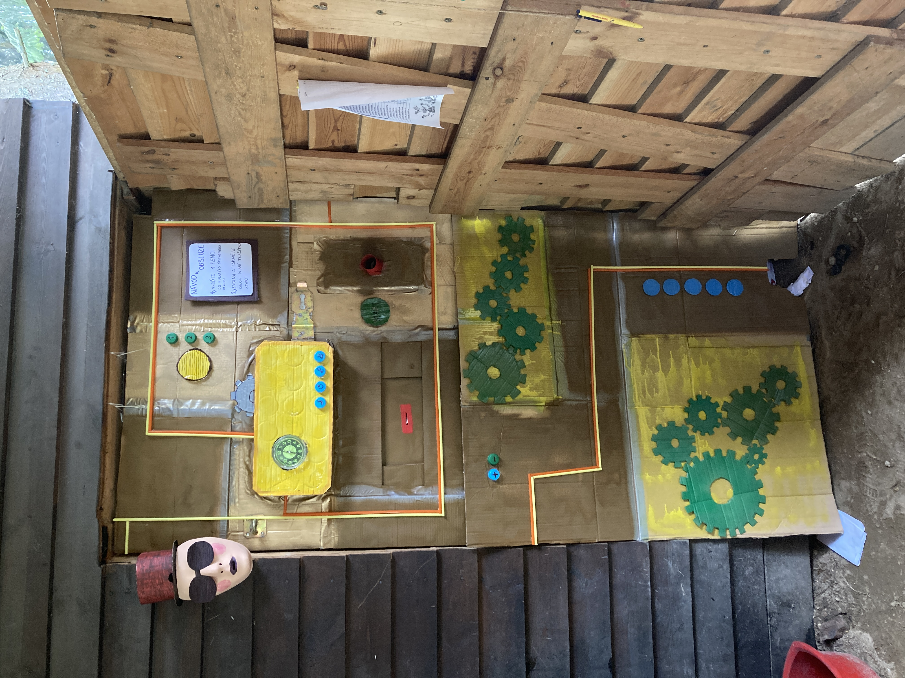
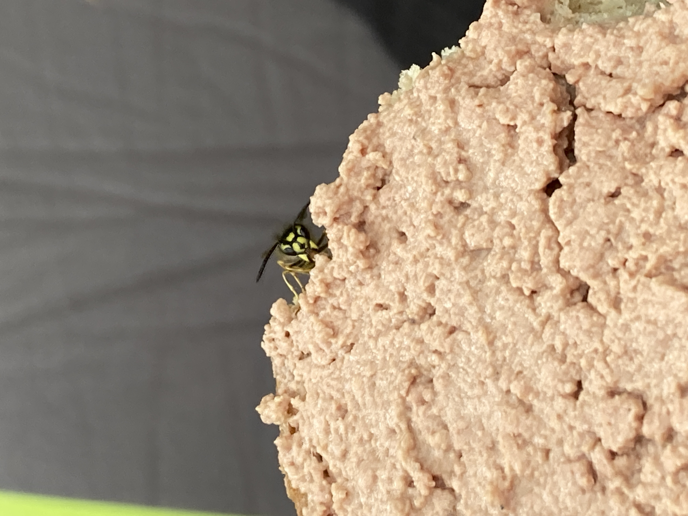
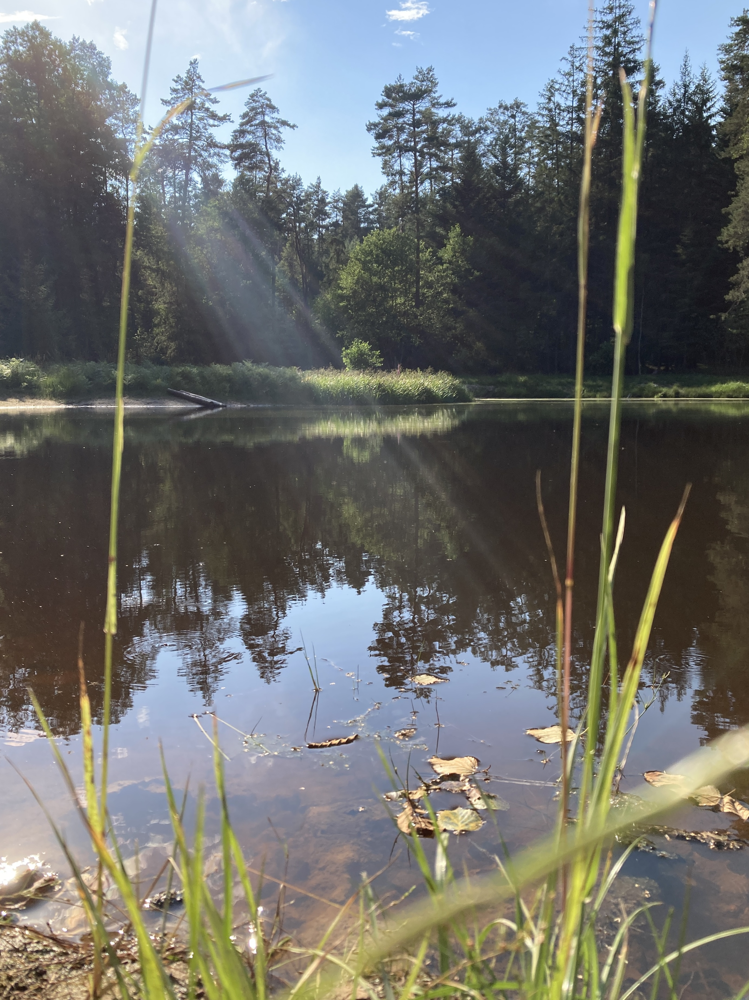
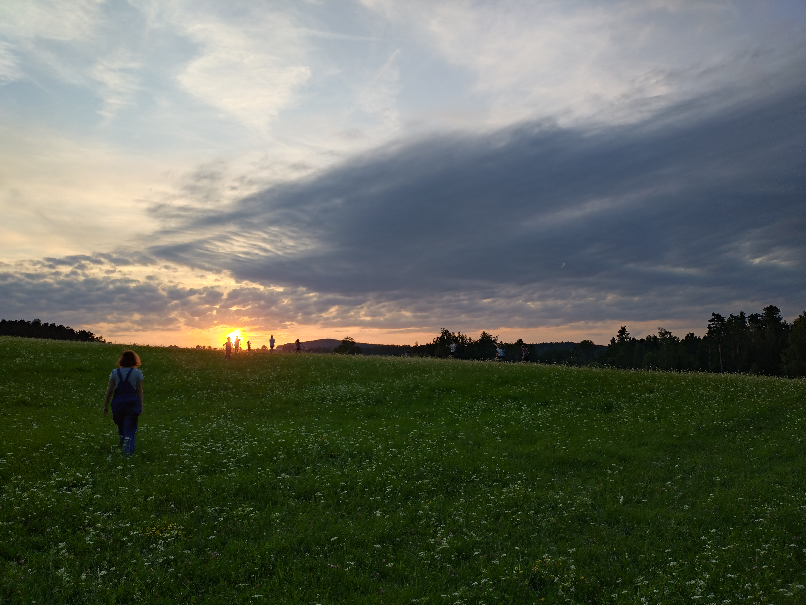
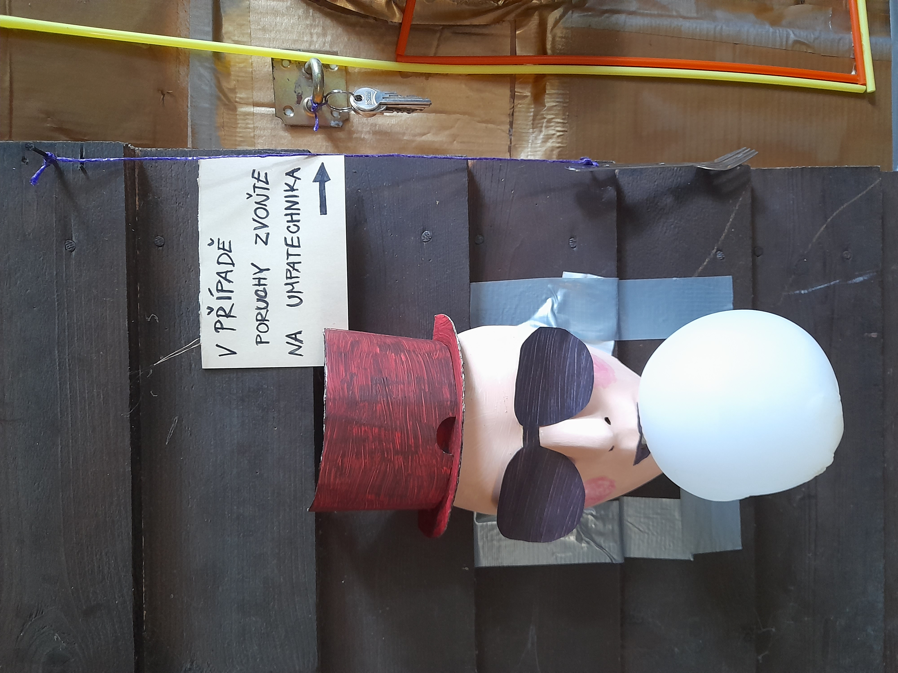

Článkem v novinách to začalo.

Pokračovalo popovodňovou továrnou,

barvením továrních úborů

nebo třeba zprovozněním žvýkačkového stroje.

Přežili jsme přemnožení šestinohých mazlíčků,

koupání v čokoládové tůni

i výlet za poznáváním nových chutí.

Teda, většina z nás...

Krásný rok vám přejí umpalumpové

a samotný Willy, který vám navíc uděluje užitečnou radu:

Ten, kdož by se chtěl za dobrodružstvím v továrně ohlédnout více, nechť tak směle učiní: [fotky](https://eu.zonerama.com/vlci-keblany/1303470?secret=R29V8G02MMYv0gPl94klH1g49&count=46)