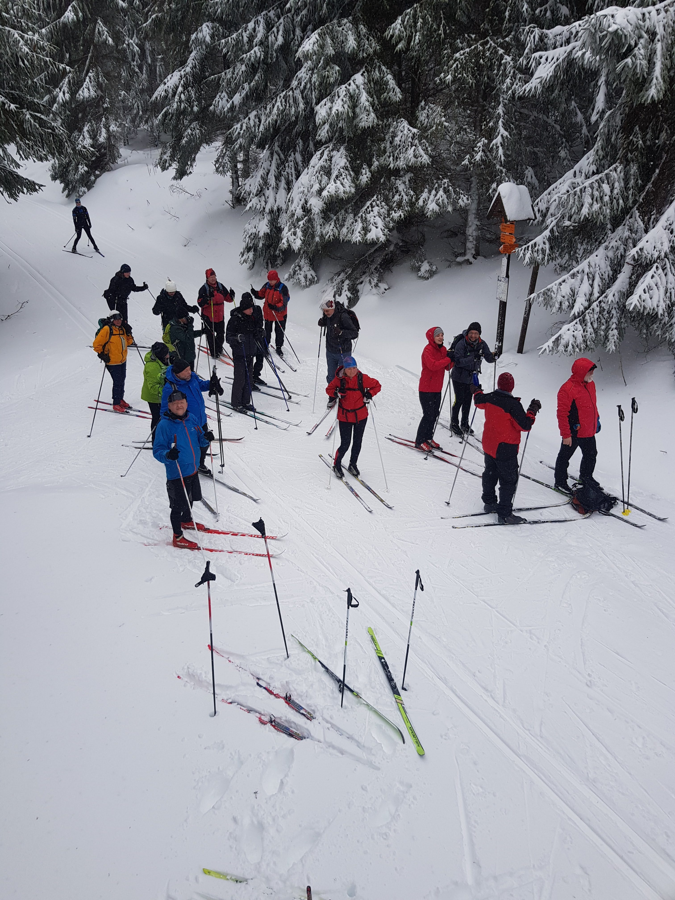

Letos se lyžařská výprava konala na Sudétu, i přes covidové peripetie jsme se nakonec sešli v hojném počtu. Sobotní výlet z Perninku do Potůčků a zpátky nám připomněl, jak dříve vypadalo české pohraničí, a po cestě se našla i chvíle na stavění sněhuláků. Nedělní přechod do Přebuzi, kolem opuštěné zpracovny cínu, byl zakončen napínavým čekáním na autobus, který bojoval se sněhovými podmínkami. Náladu to však nijak neovlivnilo, jelikož nejhorší chvíle jsme přečkali v autobusové zastávce, plameně debatujíce, kdo bude v případě nepříjezdu autobusu snězen jako první.

Kdo nebyl na výpravě zkonzumován můžete zkontrolovat na [fotkách](https://keblany.rajce.idnes.cz/Vlci_bezky_01_2022/).

