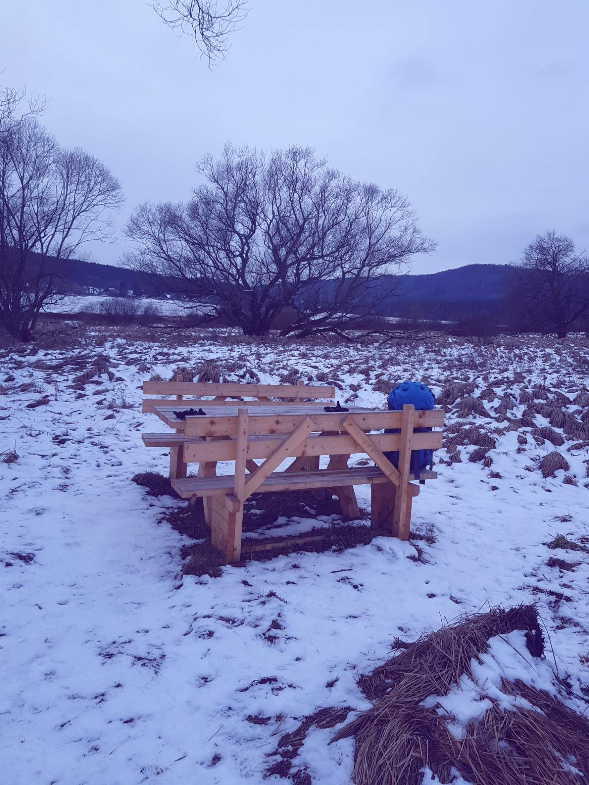

Vlčí tlemení týmu konalo se letos na šumavské chatě Gabreta ve Stožci. Účastníci sice co do počtu hravě předčili počet vloček pokrývajících šumavské pláně, to ale náladu smečky nijak neohrozilo. Ani název akce nebylo třeba příliš pozměnit, naše mateřština totiž nikdy nenechá Vlka na holičkách. A procházka v běžkových botech po krásně křupajícím štěrku je bezesporu inspirativním zážitkem. Největší zásluhy má Brumbál za organizaci celého klání! Vizte [fotky](https://eu.zonerama.com/vlci-keblany/1303470?secret=R29V8G02MMYv0gPl94klH1g49&count=46) na rajčeti.

