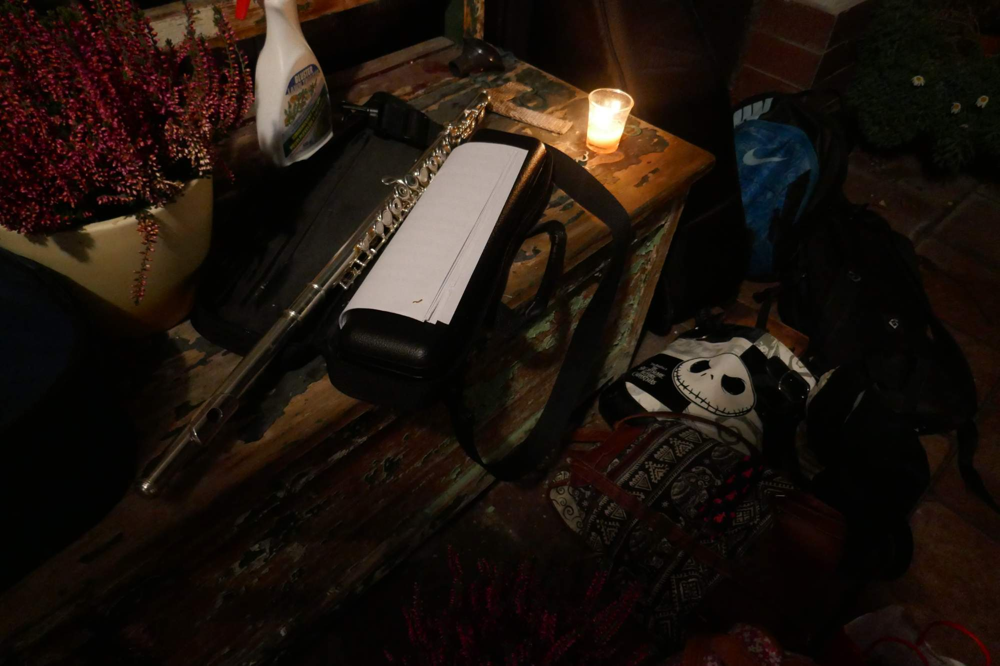

Vánoce jsme oslavili velkolepým způsobem u Hlaváčků na zahradě. Nanejvýš vkusně jsme si ozdobili vánoční levanduli a s trochou hledání, jsme pod jejím košatým větvovím našli a předali si dárečky. Jelikož byla účast hojná, společně zanotované koledy toho večera bezpochyby potěšily ucho nejednoho Žižkováka. Náš ensemble navíc vytvořil mohutné nástrojové těleso, ve kterém nechyběly flétny, housle, akordeon, klarinet ani improvizované bicí nástroje všeho druhu. Všem, kdož chtějí nasát vánoční atmosféru, doporučujeme fotky [zde](https://eu.zonerama.com/vlci-keblany/1303470?secret=R29V8G02MMYv0gPl94klH1g49&count=46) a skvostnou nahrávku koledy v podání Vlčího orchestru a sboru [zde](https://drive.google.com/file/d/1qgby3wxdPIag1Vm77TDB9-Gszle67fHG/view?usp=sharing).

Mastný a kyselý!

