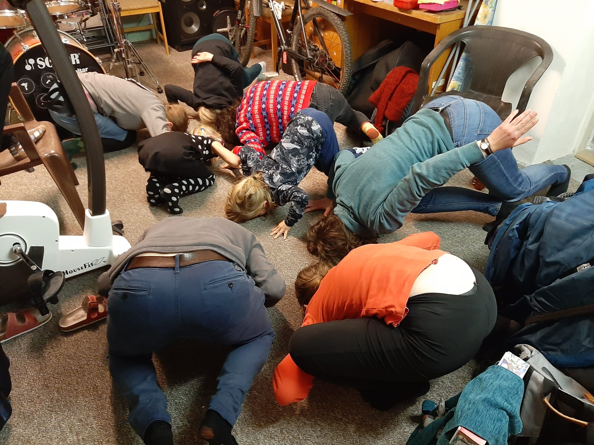

Dvě stě dvacáté první narozky našeho Ježíška jsme letos oslavili u Áňů na Břevnově. Ozdobili jsme vánoční meruňku, okoštovali cukroví přinesené z rodných vlčích doupat, zapěli koledy... Při těch jsme dokonce zvládli putovat ze židle na židli, ze stoličky na rotoped a do lecjakých jiných výšin - na koho posezení nezbylo, zůstal stát až do dalšího přerušení koledy, což se ovšem v přítomnosti krabiček s cukrovím dalo vydržet. V závěru večera jsme se proměnili ve zvířata všeho druhu a rozhodli se přelstít fyzikální zákony stojem na uších.

Račte proštudovat [fotky](https://eu.zonerama.com/vlci-keblany/1303470?secret=R29V8G02MMYv0gPl94klH1g49&count=46)!

