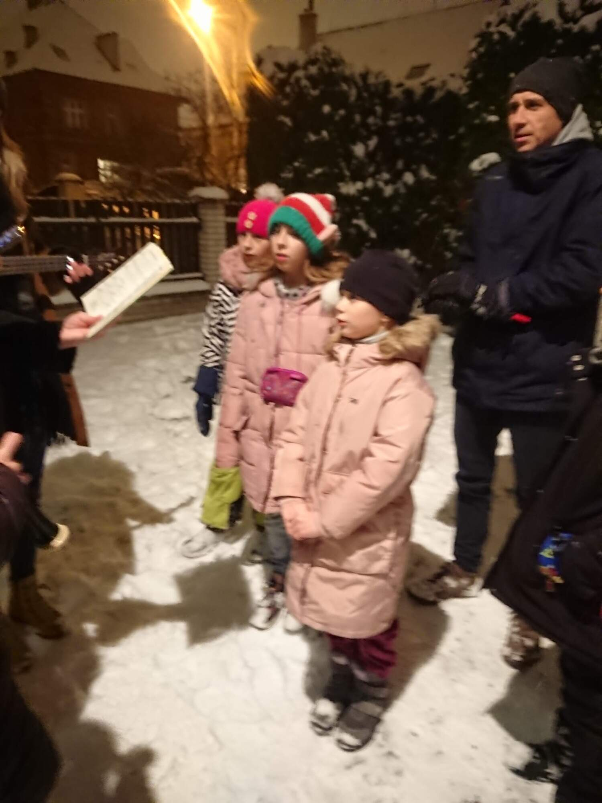

Vlčí rok 2022 jsme zakončili společnou oslavou vlčích Vánoc - a byly bílé! Ozdobili jsme vánoční stěnu, rozdali si dárky a zpívali v chumelenici koledy. Vlčí tradice praví, že kdo se trefí obřadnou špejlí do hrnce, bude mít hodně dovedností a štěstí v příští celotáborovce. V teple jsme pak hráli spoustu kol Soch ve vánoční akci, měli svařený mošt s cukrovím a vánočním pudinkem. Fotky najdete [na rajčeti](https://eu.zonerama.com/vlci-keblany/1303470?secret=R29V8G02MMYv0gPl94klH1g49&count=46) jako vždycky.

O prázdninách si můžete zahrát taky a zkusit předvést vykrajovátko na cukroví, balící papír nebo adventní kalendář!

