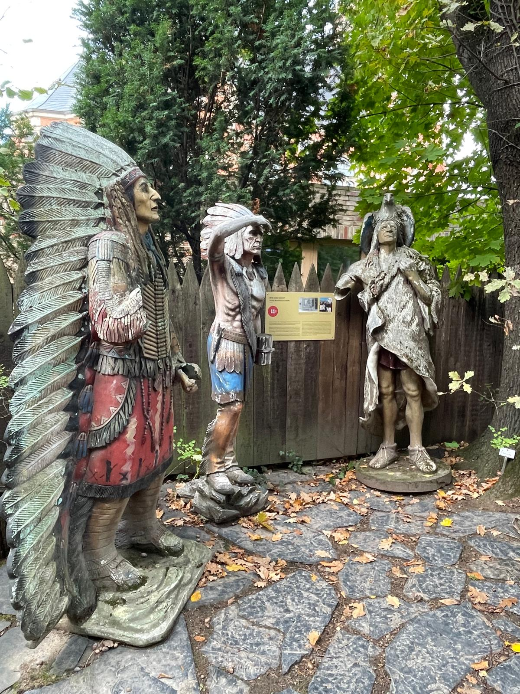

Náš podzimní výlet začal autobusem do Teplic a dále na Cínovec. Po příjezdu na hranici nás přivítal děda Báry a Ondry a pohostil nás horkým čajem, který v sychravém počasí přišel velmi vhod. Tedy dlužno dodat, že Jonáš a Kryštof se po teplém čaji hned vykoupali ve studeném jezírku. Poté jsme pokračovali k vodopádům a dále směrem k Altenbergu, cestou přes velkou propadlinu po středověké těžbě – Altenberskou Pinku. Právě tam nás zastihl prudký déšť a citelné ochlazení. I přes nepřízeň počasí jsme však dorazili do Altenbergu v dobré náladě. Večer jsme strávili v teple a pohodě. Zábavu rozproudila hra Městečko Palermo a menší kluci (Jakub a Tristan) se s nadšením pustili do stavění stavebnice – vznikla přitom řada zajímavých strojů. Druhý den ráno jsme nasedli na vlak a vydali se do Drážďan. Hlavním cílem byla návštěva muzea Karla Maye, kde jsme se – po pár týdnech od tábora – znovu ponořili do světa Vinnetoua, Old Shatterhanda a jejich kumpánů. Po prohlídce jsme vyšplhali na vinici nad městem, odkud se nám otevřel krásný výhled na celé město. Zrovna probíhalo vinobraní a tak jsme neplánovaně zažili i atmosféru místních slavností.

Na fotky se můžete podívat [TADY](https://eu.zonerama.com/vlci-keblany/1303470?secret=R29V8G02MMYv0gPl94klH1g49).

