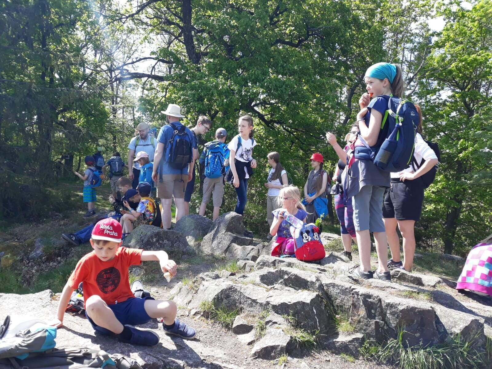

Cesta z Prahy přes Bábovku do Strašic a zase zpátky do Prahy byla plná stavění domečků, hry na schovku a babu a samozřejmě bábovek. Bábovka (koláč) byla boží. Nejlepčí měl Jenda, ač tvrdil, že připálenou. Bábovka (kopec) byla taky boží, protože opravdu vypadala jako bábovka a na vrcholu byla keramická bábovka. Mimochodem, věděli jste, že původně se pojmenování bábovka vyvinulo ze staročeského slova bába. Bábovka znamenala pekáč, tedy formu na bábu. Původ slova snad pochází polského slova bába, v překladu dětské jídlo (že by zemlbába?). Tak zas příště na nějakém Vlčím výletě. A koukněte na [fotky](https://eu.zonerama.com/vlci-keblany/1303470?secret=R29V8G02MMYv0gPl94klH1g49&count=46)

