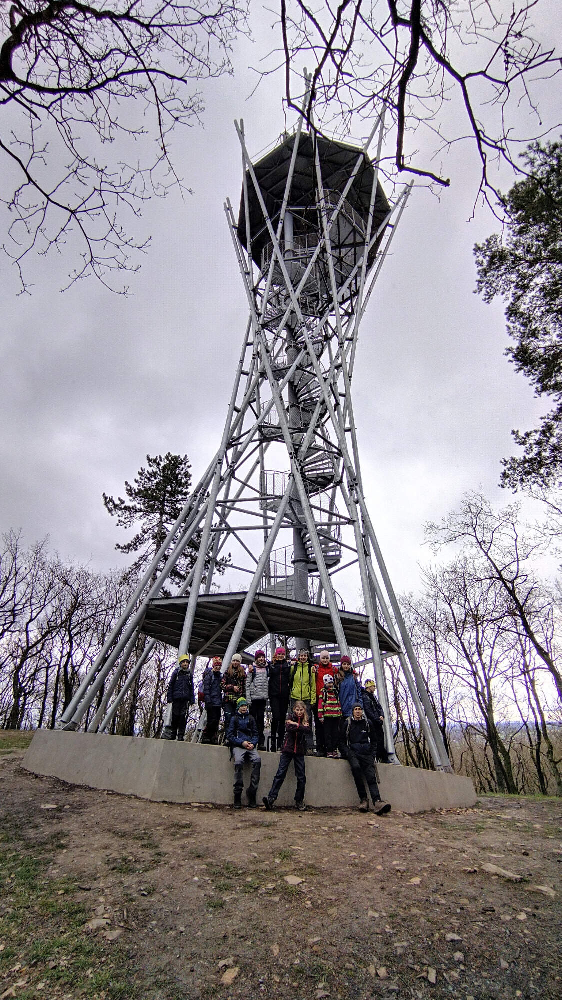

Autobus nás vyplivl v Mníšku pod Brdy, z kterého jsme vystoupali cestou, jež polovinu času spokojeně hrála hru na říční koryto, vzhůru ke klášteru Skalka. Pokochali jsme se kostelíkem a křížovou cestou a dokráčeli odtud až na Kačenovic Korunku. Šlo to s ní trochu z kopce, ale jelikož to bylo schválně, vyšplhali jsme nahoru. Odměnou nám byly výhledy až na Bezděz a obědovou pauzu. Po ní jsme ohoblovali všechny oslavence a chvíli pozorovali srocení skautů z Břevnova. Nakonec jsme se kolem Černolických skal a přes pár brdéček skutáleli z kopců do Všech nor a vyrazili vláčkem ku Praze.

Klíčovým účastníkem výletu byl Valinovic gumový balon, který v kombinaci s hrou na přírodní katastrofy spolehlivě preventoval veškeré bolenohy, jásenudimy i kdyužtambudemy. Bylo tam prostě krásně, jedna bota nezůstala suchá.

Fotky k pokochání najdete [zde](https://eu.zonerama.com/vlci-keblany/1303470?secret=R29V8G02MMYv0gPl94klH1g49&count=46).

