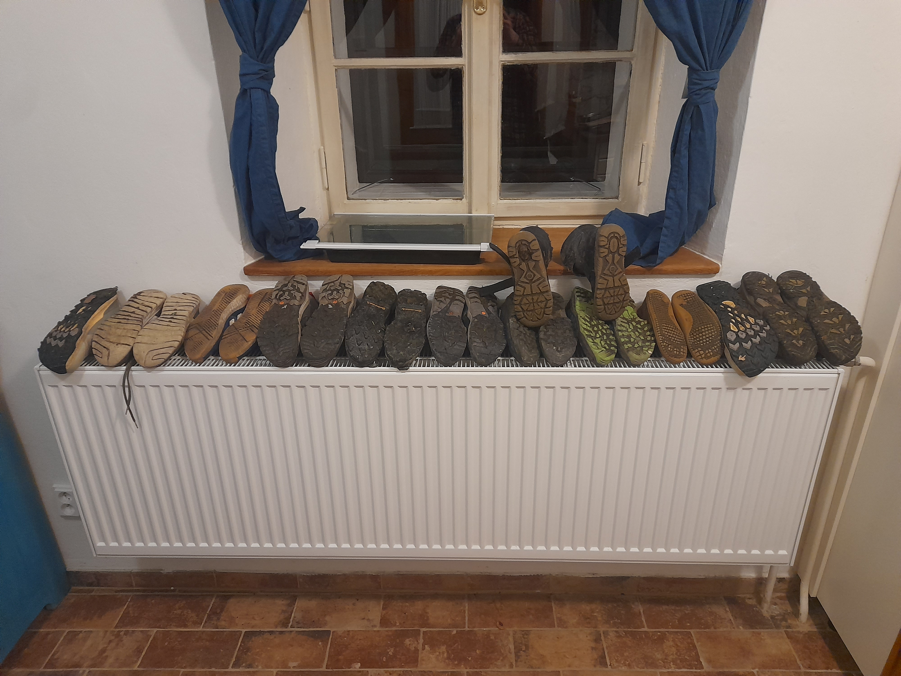

9.11. jsme vyrazili z Hlavního nádraží vstříc malebné náhražce Adršpachu do okolí Příbramska. Vlakem, který se ve Zdicích změnil v autobus, jsme postupně dojeli až do Příbrami, kde se k výpravě připojil Jakub a odkud jsme následně dalším autobusovlakem dojeli do cílové stanice, do Milína. Už od Berouna jsme se marně pokoušeli sejít s Maruškou Beranovou, což se nám nakonec na okraji Milína podařilo. Prošli jsme dopoledním Sluncem zalitou obec a vyškřábali jsme se na loučku za Milínem, kde jsme si odpočinuli a poobědvali chléb, kiri, okurky a májky, čili klasickou vlčí výletní stravu.

Další zastávka, na kterou jsme přišli po chvíli bloumání spadlým listopadovým listím (díky Wabi) byla na paprsky prosluněné louce nad Rtišovicemi. Zde jsme si dali seznamovací hru na jména v kruhu (a lá duel) a následně, když už jsme znali všechna jména, jsme zahráli mnoho kol staré dobré Schovávané, kterou si nejvíc užíval Vašek Řehák, ale mazali jsme ji všichni svorně a radostně. Cesta nás vedla dále Rtišovicemi k rybníku Kacíř, na jehož hrázi se strhla doutníková bitva. Obaleni chmířím jsme došli do Luhu a odtud přes louky na Drsník. To už nám na cestu svítily jen poslední sluneční paprsky. Pozdravili jsme kočku, kozy a sebehli z kopce k domu č.p.15, na Šalandu k Šikolům. Zde jsme v teple vybalili věci, pojedli horkou bramboračku, vlčí večeři (chléb, salám, sýr, okurka atd.) a přesunuli se do pokroví na večerní řádění a hraní na kytaru. Nakonec, vyzpívaní, jsme usnuli.

V neděli 10.11. zrána jsme pojedli ze ztenčujících se zásob a nalehko vyšli do mlhy a jinovatky. Cesta nás vedla polem, loukou a lesem kolem starého hamru, starého parního mlýna, mezi pastvinami pro koně až do Smolotel. Zde jsme započali výstup na Makovou horu, poutní kostelík, tvořící malebnou dominantu kraje. Posvačivše jablka vyfotili jsme se a seběhli z zpět do vesnice a de facto stejnou cestou zpátky na Šalandu.

Času jsme měli habaděj, ale zima nám lezla za nehty. Vyrazili jsme na autobus do Prahy přes Drsník, Dalskabáty hříšnou ves, kolem stěžovského mlýna (zde byla teplotní krize jistých členů výpravy) a za soumraku narazili na pravého vlka střežící příchozí cestu do Stěžova. Vlk měl k sobě naštěsí páníčka, takže nás nesežral, ale bylo to o fous. Na stěžovské zastávce jsme snědli všechny zbytky, které jsme měli (až na jistý salám, dobře schovaná na dně jednoho z batohů) a přes Příbram jsme dorazili na Smíchovské nádraží, kde tato podzimní taškařice nakonec skončila.

Fotkami se můžete pokochat [TU](https://eu.zonerama.com/vlci-keblany/1303470?secret=R29V8G02MMYv0gPl94klH1g49)

