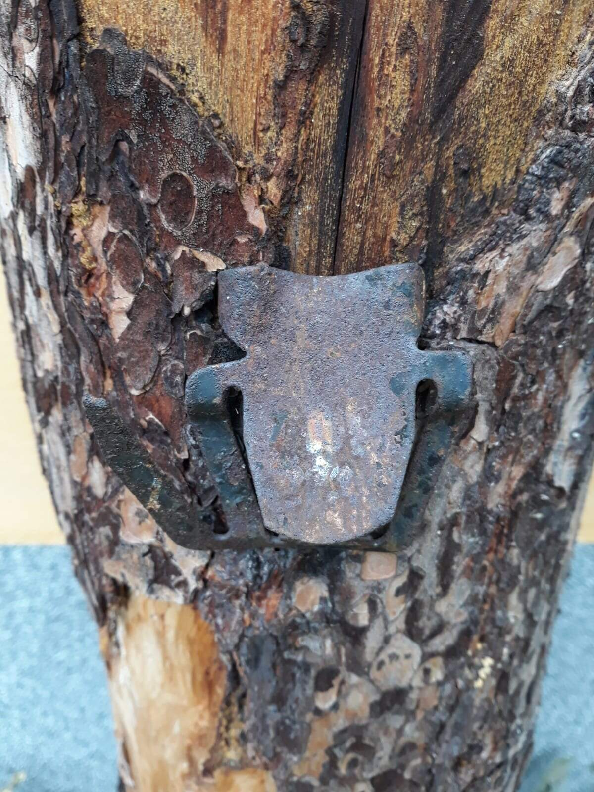

Výlet do Muzea těžby borové smoly v Lomanech u Plas se jedním slovem povedl. Sešlo se nás devatenáct a od vlaku z Plas jsme se kombinací chůze a hraní her dostali až do Loman. Tam nás přivítala paní Čiháková - dcera posledního mistra těžby smoly a vnučka posledního hajného knížete Metternicha, která v roce 2006 otevřela Muzeum borové smoly v "jejich" hájovně Lipovka v Lomanech. Seznámila nás se zaniklým oborem a dala praktických rad pro táborovou těžbu pro naše louče a pochodně. Na oplátku jsme ji pomohli přestěhovat v hájovně skříně a na závěr jsme si ještě opekli buřtíky na ohýnku před hájenkou. Potom už jenom cesta zpět, přestup v Plzni na supermoderní vlak a na Hlaváku jsme vpadli přímo do rukou maminek - my plni dojmů z výletu a naše batohy plny kelímků na sběr smoly.

Fotky z vydařené akce vizte [ZDE](https://eu.zonerama.com/vlci-keblany/1303470?secret=R29V8G02MMYv0gPl94klH1g49&count=46).

