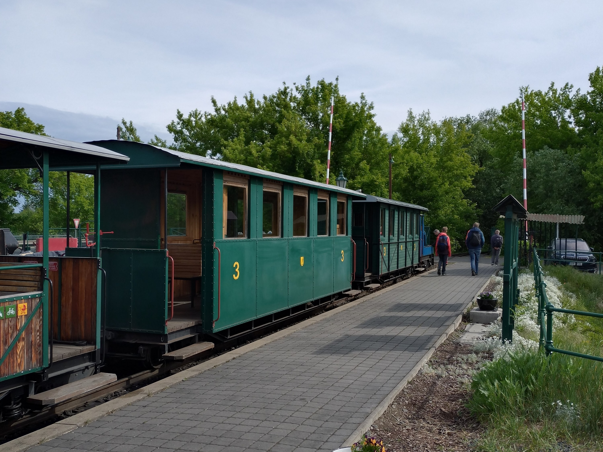

Podobně jako proslulí dva medvědi, i naše početná skupina čítající 23 malých a velkých hlav se v sobotu potkala u Kolína. Přesněji v Sendražicích na hlavním nádraží Kolínské řepařské drážky (<https://www.reparskadrazka.cz/>) - krásného úzkokolejného vláčku, který dříve převážel řepu do kolínského cukrovaru. Teď převáží výletníky, šotouše a indiány. Všechny tyto kategorie zvládla naše skupina pokrýt, výlet vláčkem ani prohlídku malého muzea v nádražní budově jsme si proto nemohli nechat ujít.

Na konečné stanici se indiánská výprava rozcvičila na hřišti a zanořila se do hloubi kolínských lesů. Vynořila se v osadě Jelen, kde zapěla píseň Jelen od kapely Jelen. Jsem akorát jelen z toho, že jsme píseň asi už dlouho nehráli, neboť je mnoha indiánům neznámá. Uff uff, budeme to muset na táboře napravit!

V osadě Včelín jsme dychtivě vyhlíželi mapami.cz slíbenou sbírku totemů. Inu, byla tam, ale u někoho na zahrádce... Nakoukli jsme alespoň přes plot a vydali se utišit prázdné žaludky do lesíku o kus dále. Píseň Včelín nám potom šla o moc lépe.

Pro uťapané mokasíny se v pravý čas vynořil zpoza stromů malý bufet s limčou a trampoškou na břehu jezera zbylého po meandrech Labe. Podél řeky jsme pak dokráčeli na kolínské vlakové nádraží a vyrazili tentokrát širokokolejným a řádně přeplněným vlakem ku Praze. Kdo by se chtěl pokochat naším indiánským dobrodružstvím v dvojrozměrné podobě, nechť zkoukne [FOTKY](https://eu.zonerama.com/vlci-keblany/1303470?secret=R29V8G02MMYv0gPl94klH1g49&count=46).

