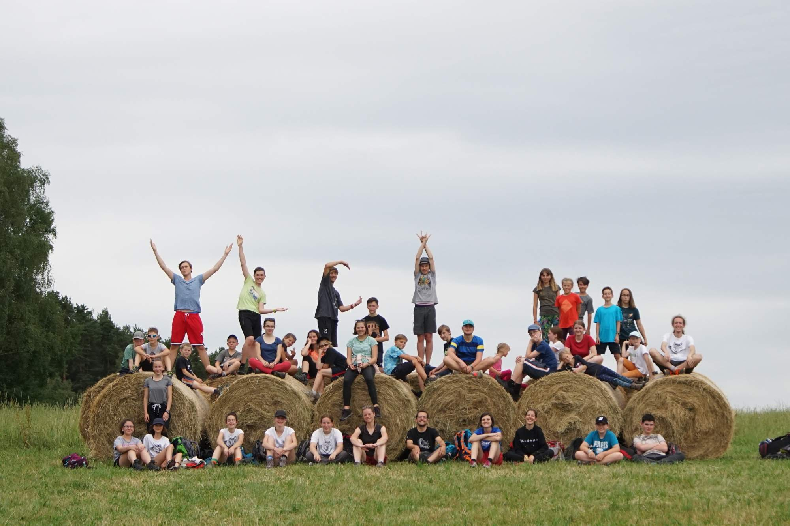

九州から北海道まで日本を探検しました！ 4人の高貴な日本の家族が幕府をめぐって争い、天皇自身に会う名誉を持っていました。そして、彼らが戦っていなかったとき、彼らは寿司を楽しんだり、工場を訪れたり、刀でスイカを切ったりしました。 キャンプの終わりに、テレズカとメアリー、そして家族の8人の勇敢な長老は、すばらしい栄光で私たちに別れを告げました。彼らに栄光を!\
[写真](https://eu.zonerama.com/vlci-keblany/1303470?secret=R29V8G02MMYv0gPl94klH1g49&count=46)

\    Nejlepší přítel

\    Vlka v nesnázích bývá

\    Google překladač